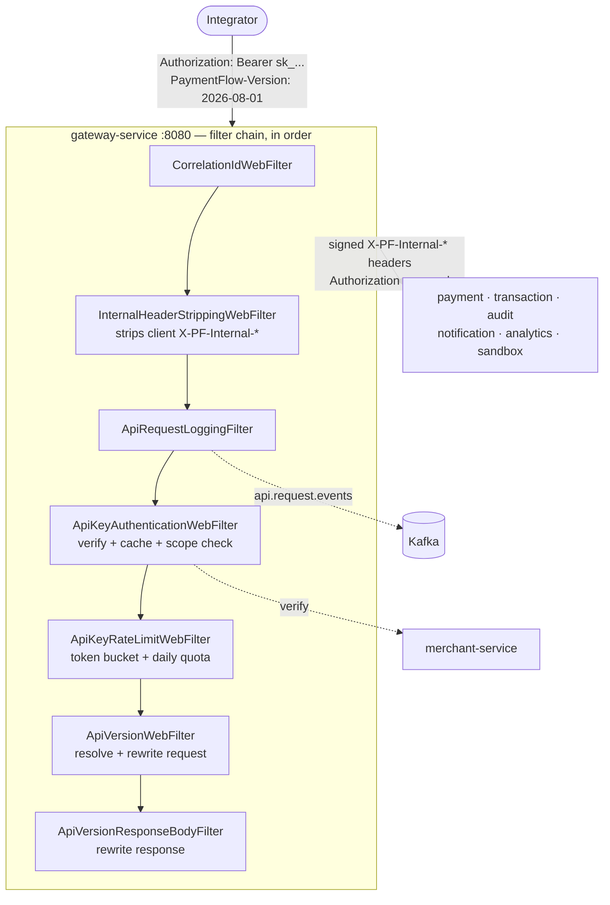
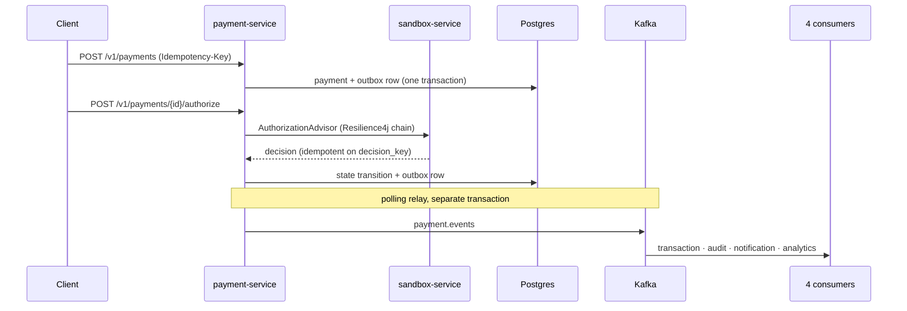

# CLAUDE_CONTEXT.md — Repository Operating Manual

> **What this file is.** A living snapshot of the repository *as it exists today*, written so a
> new session can work safely without reading the engineering history.
>
> **What it is not.** A change log. It records the present tense only.
>
> | Document | Role | Tense |
> |---|---|---|
> | `PROJECT_CONTEXT.md` | Frozen historical record of **V1** (M0–M14) | Past |
> | `PROJECT_CONTEXT_2.md` | Complete engineering journal for **V2** (M15–M30) | Past + plan |
> | **`CLAUDE_CONTEXT.md`** | **What the repository is right now** | **Present** |
>
> When this file and the code disagree, **the code wins** — fix this file. When this file and
> `PROJECT_CONTEXT_2.md` disagree on *why* something is the way it is, the journal wins; this
> file only records *what* is true now. Maintenance rules are in §20.

---

## 1. Repository Identity

| Field | Value |
|---|---|
| **Project** | PaymentFlow — Distributed Payment Orchestration Platform |
| **Purpose** | A payment processor's orchestration layer — payment lifecycle FSM, double-entry ledger, and asynchronous state propagation — built across independently deployable microservices. A portfolio/engineering project, not a production payment system. |
| **Repository version** | V2 in progress (V1 complete and frozen) |
| **Development phase** | Phase B complete — *Product surface*; Phase C in progress (see §3) |
| **Current milestone** | **M22 in progress** — Node & Python SDKs. M22.0–M22.3 complete; M22.4 next |
| **Branch** | `main` |
| **Latest commit** | *docs(m22): synchronize PROJECT_CONTEXT_2.md and CLAUDE_CONTEXT.md through M22.3* |
| **Repository health** | Healthy |
| **Build status** | `./gradlew build --max-workers=2` — **BUILD SUCCESSFUL** |
| **Test status** | **993 tests, 0 failures, 0 errors, 0 skipped** (13 modules — §18), plus 54 Node and 32 Python |
| **Working tree** | Clean |
| **Public API revision** | `2026-08-01` current; `2026-07-27` superseded (sunset 2027-08-01) |

**Verify these before trusting them** — see §19. They were true at the commit named above.

---

## 2. Executive Repository Summary

**What this is.** A Gradle multi-module JVM monorepo containing nine Spring Boot microservices,
seven shared/tooling modules, two client SDKs outside the JVM build, a Terraform estate, a
Docker Compose stack, and an observability stack. It implements the orchestration layer of a card-payment platform: creating a payment,
authorizing it, capturing funds, refunding or voiding, and propagating every state change to the
services that need to know.

**Why it exists.** It was built to hold up under backend and distributed-systems scrutiny rather
than to be the shortest path to accepting a payment. The distributed-systems concerns *are* the
subject: idempotency under concurrent retry, a transactional outbox instead of a dual write,
schema-per-service instead of a shared database, at-least-once delivery with idempotent
consumers instead of a claimed exactly-once guarantee, and integer minor units instead of
floating-point currency.

**Major capabilities as they exist today.**

- **Payments** — a state machine over create → authorize → capture → refund/void, with
  `Idempotency-Key` on every mutation backed by a Redis lock plus a durable replay record.
- **Double-entry ledger** — balances derived from ledger entries, written under optimistic-lock
  retry.
- **Event pipeline** — a polling transactional outbox publishing to Kafka; four independent,
  idempotent consumers.
- **Two authentication tiers** — JWT (dashboard, `/api/v1`) and API keys (public, `/v1`), the
  latter with scopes, test/live mode binding, per-key rate limits and daily quotas.
- **Test/live isolation** — mode is bound to the key and enforced structurally at the repository
  layer; no header or parameter can change it.
- **Sandbox** — a deterministic decision engine with a seeded test-card catalogue (17 tokens),
  simulation overrides, and deferred outcomes.
- **Webhooks as a product** — signed deliveries, an explicit retry schedule, dead-lettering,
  auto-disable, an SSRF egress guard, a full delivery log, and manual replay.
- **Public read APIs** — cursor-paginated lists for payments, refunds, balance, ledger entries,
  events, analytics, request logs and usage.
- **API contract** — a generated, merged, committed OpenAPI 3.1 document, fully described and
  gated three ways (fresh, compatible, and satisfied by real responses); a catalogued error
  contract; and date-based versioning with per-merchant pinning and an edge transformation layer.
- **Observability** — Micrometer → Prometheus → Grafana, Loki logs, OpenTelemetry → Tempo traces.
- **Client SDKs** — a Node and a Python package generated from the published contract by one
  shared generator, with the generated half gated against drift by the build.

**Current maturity.** V1 (M0–M14) is complete, was deployed to real AWS infrastructure, and is
frozen. V2 (M15–M30) is in progress: **M15–M21 complete; M22 under way (M22.0 and M22.1
done)**. There is **no frontend** — the developer portal is M23/M24. The Node and Python SDKs
are M22; Java and Go are M26. Nothing in V2 has been
deployed to AWS; V2 is deliberately local-first, with a single deployment milestone (M29) at the
end.

**Architectural philosophy, as actually practised in this repository.**

1. **Verify, never assume.** Every completion claim is backed by something actually executed.
   Tests run against real Postgres/Redis/Kafka via Testcontainers, not mocks, wherever the thing
   under test is an interaction with infrastructure.
2. **Record the trade-off, not just the choice.** 165 numbered decisions (D1–D165) each carry the
   alternatives that were rejected and why.
3. **Make invalid states unrepresentable** in preference to remembering not to create them —
   database constraints, entity-level guards, and compiler-enforced interfaces over conventions.
4. **The public contract is a promise; internal tiers are not.** `/v1` is versioned, documented
   and frozen. `/api/v1` and `/internal/v1` are deliberately undocumented and freely changeable.
5. **Documentation that can be tested, is.** `docs/READ_APIS.md`, `docs/ERRORS.md`,
   `notification-service/docs/WEBHOOKS.md` and `docs/openapi.yaml` each have a test that fails
   when the code and the document disagree. For the OpenAPI document that goes further than
   consistency: real responses are validated against it, and the prose itself is enforced — an
   operation without a summary, a parameter without a description, or a field without one fails
   the build.

---

## 3. Current Repository State

### Completed

| Version | Milestones | Status |
|---|---|---|
| **V1** | M0–M14 | ✅ Complete and frozen. Deployed to AWS and verified end-to-end over a public ALB; the estate has since been torn down. History in `PROJECT_CONTEXT.md`. |
| **V2 Phase A** | M15 API keys · M16 test/live mode · M17 sandbox · M18 webhooks | ✅ Complete |
| **V2 Phase B** | M19 read APIs · M20 metering & per-key limits · M21 OpenAPI, versioning, errors | ✅ Complete |

### In progress

**M22 — Node & Python SDKs.** See §17 for full detail. The first milestone to consume
`docs/openapi.yaml` as an input rather than produce it.

| Sub-milestone | Scope | Status |
|---|---|---|
| M22.0 | Platform prerequisites — the transport headers, and `ApiError.type` as an enum | ✅ |
| M22.1 | The SDK foundation — `sdks/`, the shared generator, both skeletons, CI | ✅ |
| M22.2 | The Node SDK core — config, transport, idempotency, retries, errors, pagination | ✅ |
| M22.3 | The Node resources — eleven namespaces over all 31 published operations | ✅ |
| M22.4+ | Webhook signature verification, then Python parity, examples, packaging, dry-run release | ⬜ next |

### Remaining roadmap

| Milestone | Phase | Summary |
|---|---|---|
| M23 | C | Developer portal part 1 — auth, merchants, keys, payments |
| M24 | C | Developer portal part 2 — webhooks, logs, analytics, admin |
| M25 | C | Documentation site & developer experience |
| M26 | C | Java & Go SDKs |
| M27 | D | Security hardening & multi-tenancy review |
| M28 | D | V2 performance engineering |
| M29 | D | AWS deployment of V2 (the only V2 infra milestone) |
| M30 | D | Launch readiness & portfolio artefacts (includes the README rewrite) |

### Implementation status in one line

Every service is bootable and tested; the public API is complete, documented, versioned and
machine-readable down to its transport headers; the SDK generation pipeline exists and is gated;
and the Node SDK is a working client — every published operation is callable, with idempotency,
retries, pagination and typed errors. What M22 still owes is `webhooks.constructEvent`, then the
same client in Python.

---

## 4. Repository Structure

```
/
├── build.gradle.kts            Root build — intentionally thin
├── settings.gradle.kts         Module graph + build-logic included build
├── gradle/libs.versions.toml   Version catalog (single source of versions)
├── gradle.properties           Parallel + caching + configuration cache
├── build-logic/                Convention plugins (separate included build)
├── platform-bom/               Dependency alignment (java-platform)
├── common-dto/                 Framework-free data contracts
├── common-lib/                 Spring Boot auto-configuration starter
├── openapi-tools/              OpenAPI merge, diff and validation tooling (M21)
├── test-support/               Shared contract-test scaffold (M21.7)
├── sdks/                       Node & Python SDKs + the shared generator (M22)
│   ├── shared/                 :sdks:shared — the Java generator and the golden fixtures
│   ├── node/                   npm package (not a Gradle project)
│   └── python/                 PyPI package (not a Gradle project)
├── load-tests/                 Gatling suite (M14)
├── gateway-service/            :8080  reactive edge
├── identity-service/           :8081
├── merchant-service/           :8082
├── payment-service/            :8083
├── transaction-service/        :8084
├── audit-service/              :8091
├── notification-service/       :8092
├── analytics-service/          :8093
├── sandbox-service/            :8094
├── docs/                       Published integrator docs + openapi.yaml
├── docker/                     Postgres init scripts
├── observability/              Prometheus, Grafana, Loki, Tempo, Alertmanager, Promtail
├── terraform/                  IaC — bootstrap, environments/dev, 12 modules
├── .github/workflows/          ci.yml, cd.yml
├── Dockerfile                  One parameterized multi-stage build for all services
├── docker-compose*.yml         Platform, infra, observability
├── PROJECT_CONTEXT.md          V1 history (frozen)
├── PROJECT_CONTEXT_2.md        V2 engineering journal
└── CLAUDE_CONTEXT.md           This file
```

**Ports jump 8084 → 8091** to avoid Kafka-UI's 8085 (D48).

### Non-service directories

| Directory | Purpose | Notes |
|---|---|---|
| `build-logic/` | Two precompiled convention plugins: `paymentflow.java-conventions` (Java 25 toolchain, UTF-8, `-parameters`, JUnit platform) and `paymentflow.openapi-fragment` (the `openApiFragment` task, applied by the six public-API services). | A **separate included build**, not a subproject. Changes here affect every module. |
| `docs/` | `openapi.yaml` (generated, committed), `ERRORS.md`, `READ_APIS.md`, `VERSIONING.md`. | Written for integrators, not for this repository. Each is asserted by a test. **Excluded from Docker build contexts.** |
| `terraform/` | `bootstrap/` (S3 + DynamoDB remote state), `environments/dev/` (the one root), `modules/` (12). | V1's estate. **Not yet extended for V2** — that is M29. |
| `observability/` | Compose-mounted configuration for the monitoring stack. | Local only; nothing is deployed (D84). |
| `load-tests/` | 7 Gatling simulations, a seeded merchant pool. | Black-box HTTP against a running platform; deliberately does **not** depend on `common-dto`/`common-lib` so it exercises the real contract. |
| `sdks/` | The Node and Python client libraries, and the one generator that feeds both. | Only `sdks/shared` is a Gradle project (`:sdks:shared`). `sdks/node` and `sdks/python` have their own toolchains and their own CI job — **neither Node nor Python is a prerequisite for `./gradlew build`** (D164). |

---

## 5. Service Inventory

All nine services share: Java 25, Spring Boot 4.0.2, Flyway migrations, a private Postgres
schema, `common-lib` auto-configuration, Micrometer metrics, and `/actuator/health|metrics|prometheus`.

### gateway-service `:8080` — reactive (WebFlux + Spring Cloud Gateway)

| | |
|---|---|
| **Purpose** | The only externally reachable service. Authenticates, authorizes, rate-limits, versions, and routes. |
| **Responsibilities** | JWT validation against identity-service JWKS; API-key verification and caching; scope enforcement; per-key rate limits and daily quotas; API version resolution and the transformation layer; internal-context signing; request logging; CORS; correlation IDs. |
| **Database** | **None.** The only stateless service. |
| **Outbound events** | `api.request.events` (M20 request logging) |
| **Inbound events** | None |
| **External deps** | Redis (key-verify cache, rate-limit buckets), Kafka (request-log producer, `max.block.ms=1000`) |
| **Internal deps** | identity-service (JWKS), merchant-service (`/internal/v1/api-keys/verify`) — all other routing is proxying, not calling |
| **Public endpoints** | Routes only — it owns no `/v1` path of its own |
| **Notes** | Filter order is load-bearing: `CorrelationIdWebFilter` (HIGHEST) → `InternalHeaderStrippingWebFilter` (+1) → `ApiRequestLoggingFilter` (+10) → `ApiKeyAuthenticationWebFilter` (+20) → `ApiKeyRateLimitWebFilter` (+30) → `ApiVersionWebFilter` (+40) → `ApiVersionResponseBodyFilter` (+41). The stripping filter removes client-supplied `X-PF-Internal-*` headers before anything trusts them. |

### identity-service `:8081`

| | |
|---|---|
| **Purpose** | User authentication and JWT issuance. |
| **Responsibilities** | Registration, login, refresh, logout, email verification, password reset, JWKS publication. |
| **Database** | schema `identity` — V1–V2 |
| **Events** | None in, none out |
| **Public endpoints** | `/api/v1/auth/**`, `/api/v1/users/**`, `/oauth2/jwks` — **no `/v1` tier** |
| **Notes** | The only JWT issuer. Its JWKS is what the gateway validates against. |

### merchant-service `:8082`

| | |
|---|---|
| **Purpose** | Merchant onboarding, profile, and API-key lifecycle. |
| **Responsibilities** | Merchant CRUD; API-key issue/rotate/revoke with grace windows; the internal key-verification endpoint; **API version pinning**. |
| **Database** | schema `merchant` — V1–V6. `merchants` carries rate-limit overrides (V5) and `pinned_api_version` (V6). |
| **Outbound events** | Outbox table exists (V4) |
| **External deps** | Redis (merchant profile cache-aside) |
| **Public endpoints** | `/api/v1/merchants/**` (JWT); `/internal/v1/api-keys/verify` (service-to-service) |
| **Notes** | `/internal/v1/api-keys/verify` **performs a write** — it pins the merchant's API version on their first call. At most once per merchant, in a `REQUIRES_NEW` transaction that can never fail the request. There is **no `merchant_settings` table**; per-merchant settings live on `merchants` (D145/D155). |

### payment-service `:8083`

| | |
|---|---|
| **Purpose** | The core orchestrator. Owns the payment state machine. |
| **Responsibilities** | Create/authorize/capture/refund/void; idempotency; transactional outbox; refunds as first-class objects; payment-method tokens; the public payments and refunds read APIs. |
| **Database** | schema `payment` — V1–V6. `payments`, `refunds`, `outbox_events`, `idempotency_records`, `processed_sandbox_events`. |
| **Outbound events** | `payment.events` (via outbox relay) |
| **Inbound events** | `sandbox.scheduled.events` — its only consumer role |
| **External deps** | Redis (idempotency lock), Kafka |
| **Internal deps** | merchant-service (OpenFeign, full Resilience4j chain), sandbox-service (`AuthorizationAdvisor` port) |
| **Public endpoints** | `/v1/payments` (+`/{id}`, `/{id}/authorize`, `/{id}/capture`, `/{id}/refund`, `/{id}/void`), `/v1/refunds` (+`/{id}`); `/api/v1/payments/**` |
| **Notes** | The **only** service making a synchronous cross-service call, and the **sole** producer on `payment.events`. Sets `server.tomcat.relaxed-query-chars: "[,]"` so the published `metadata[key]=value` filter works literally (D142) — a deliberate, scoped parser relaxation. As of API revision `2026-08-01` it emits **lowercase** `status` values. |

### transaction-service `:8084`

| | |
|---|---|
| **Purpose** | The double-entry ledger. |
| **Responsibilities** | Consume payment events; write balanced ledger entries; serve balance and ledger reads. |
| **Database** | schema `transaction` — V1–V3. `accounts`, `ledger_entries`. |
| **Inbound events** | `payment.events` |
| **Public endpoints** | `/v1/balance`, `/v1/balance_transactions` |
| **Notes** | Optimistic-lock retry under concurrent writes. `idx_ledger_entries_account_id` is retained despite being superseded for lookups, because it backs the FK. |

### audit-service `:8091`

| | |
|---|---|
| **Purpose** | The immutable audit trail, and the merchant-facing event feed. |
| **Database** | schema `audit` — V1–V3. `audit_log`. |
| **Inbound events** | `payment.events` |
| **Public endpoints** | `/v1/events`, `/v1/events/{id}` |
| **Notes** | Stores payloads **verbatim** as an opaque tree (D44) — it has no business knowing what a payment looks like. Renders the canonical `evt_` shape using `CanonicalEventType` from `common-dto`, shared with notification-service so the two cannot drift (D140). `EventResponse.data` is published as a free-form object and must stay that way: annotated with anything less than `implementation = Object.class` + `types` + `additionalProperties`, springdoc reflects Jackson's `JsonNode` class and documents its bean getters as the payload shape. |

### notification-service `:8092`

| | |
|---|---|
| **Purpose** | Webhooks as a product, plus (simulated) email. |
| **Responsibilities** | Endpoint registration and secret lifecycle; event fan-out; signed delivery; retry schedule; dead-lettering; auto-disable; delivery log; manual replay; SSRF egress guard. |
| **Database** | schema `notification` — V1–V7. `webhook_endpoints`, `webhook_subscriptions`, `webhook_events`, `webhook_deliveries`, `webhook_delivery_attempts`, `email_log`. |
| **Outbound events** | `webhook.deliveries` (+ `.retry`, `.dlq`) |
| **Inbound events** | `payment.events`, `webhook.deliveries*` |
| **Public endpoints** | `/v1/webhook_endpoints` (+`/{id}`, `/{id}/rotate_secret`), `/v1/webhook_deliveries` (+`/{id}`, `/{id}/replay`) |
| **Notes** | The largest test suite in the repository (164 tests), 32 of them the SSRF matrix. Signing secrets are **encrypted, not hashed** (D137) — they are used as HMAC keys. Has **no OAuth2 resource server**; `InternalContextFilter` is its only authentication (D133). Its Kafka producer sets **no `max.block.ms`** — see §16. |

### analytics-service `:8093`

| | |
|---|---|
| **Purpose** | Aggregates, request logging, and usage metering. |
| **Database** | schema `analytics` — V1–V5. `payment_stats_hourly`, `api_request_log`, `api_usage_daily`, `merchant_payment_stats`. |
| **Inbound events** | `payment.events`, `api.request.events` |
| **Public endpoints** | `/v1/analytics/payments`, `/v1/request_logs`, `/v1/usage` |
| **Notes** | `api_request_log` is the highest-write-volume table; it is pruned on a schedule with aggregates rolled into `api_usage_daily` first. The hourly series and refunds both **start at M19** — there is no history behind either (§16). |

### sandbox-service `:8094`

| | |
|---|---|
| **Purpose** | The deterministic simulation engine that stands in for an acquirer. |
| **Responsibilities** | Test-card catalogue; authorization decisions; simulation overrides; deferred outcomes; the decision log. |
| **Database** | schema `sandbox` — V1–V5. `test_cards` (17 seeded tokens), `simulation_overrides`, `scheduled_outcomes`, `decision_log`. |
| **Outbound events** | `sandbox.scheduled.events` |
| **Public endpoints** | `/v1/test/cards`, `/v1/test/simulations` (+`/active`), `/v1/test/decisions` (+`/payments/{paymentId}`); `/internal/v1/sandbox/**` |
| **Notes** | `GET /v1/test/cards` is the platform's **only genuinely unauthenticated public endpoint** (§8.1 of the journal) — it declares `security: []` in the OpenAPI document and is excluded from the standard 401/403 error responses. Decisions are idempotent on a caller-supplied `decision_key`; the log doubles as the idempotency store (D128). |

---

## 6. Shared Modules

### `common-dto` — framework-free data contracts

**Why it exists.** Types that cross a service boundary and must be identical everywhere. No
Spring, no web, no persistence.

**Depended on by.** Every module, transitively via `common-lib`.

**Key abstractions.**

| Type | Role |
|---|---|
| `ApiError`, `ApiFieldError`, `ErrorType` | The error envelope and its closed classification vocabulary |
| `EventEnvelope<T>` | The Kafka envelope. Payload types are deliberately **not** shared (D36). Carries `mode`, nullable and `NON_NULL`-omitted (D125). |
| `PageResponse<T>`, `CursorPage<T>` | Offset (legacy) and cursor (current) pagination envelopes |
| `CanonicalEventType` | The frozen merchant-facing event vocabulary and `evt_` id derivation (D140) |
| `ApiVersion`, `ApiVersions` | Dated contract revisions and the registry of which are served |

**Ownership rule.** A type belongs here only if it is a **frozen public contract several services
must render identically**. Internal model shapes stay per-service (D4/D36). This exception is
narrow and each use of it is a numbered decision.

### `common-lib` — Spring Boot auto-configuration starter

**Why it exists.** Cross-cutting behaviour every service needs, wired as auto-configuration.

**Depended on by.** All nine services. **Web dependencies are `compileOnly`** (D11) so the servlet
stack is never forced onto the reactive gateway; SERVLET-conditional auto-config stays inert there.

**Key abstractions.**

| Area | Types |
|---|---|
| Errors | `GlobalExceptionHandler`, `ErrorCode`, `CommonErrorCode` (13 codes), `ErrorCatalogue`, `ApiErrorFactory` |
| Security | `InternalContextFilter`, `InternalContextSigner`, `OpaqueTokenGenerator` |
| Correlation | `CorrelationIdFilter`, `CorrelationConstants` |
| Query | `CursorCodec`, `ListQuery`, `MetadataFilterParams` |
| OpenAPI | `PublicApiDocument` (D149), `PublicApiErrorResponses` (D153) |
| Redaction | `RequestRedactor` — structural JSON field redaction |
| Observability | `ObservabilityAutoConfiguration`, `ResilienceMetricsAutoConfiguration` |

**Ownership rule.** `ApiErrorFactory` is the **single assembly point** for error responses, used by
both the servlet handler and the gateway's reactive writer, so the two cannot drift.

### `platform-bom` — dependency alignment

A `java-platform` importing the Spring Boot, Spring Cloud and Resilience4j BOMs. **springdoc is
pinned by a constraint, not by importing its BOM** (D147) — importing it would re-export Boot
4.0.5's management and silently move every module in the monorepo.

### `test-support` — the shared contract-test scaffold *(test scope only, never deployed)*

Two base classes the six public-API services' contract tests extend:
`PublicApiDocumentContract` (fourteen assertions true of every fragment — 3.1, tier exclusion,
the shared contract, the universal errors, and the prose rules) and `PublicApiResponseContract`
(real calls validated against `docs/openapi.yaml`, plus the signed-internal-context helper and a
coverage check). Wired to exactly those six by the `paymentflow.openapi-fragment` convention
plugin, which already defines that set.

**A module rather than `testFixtures` on `common-lib` (D159)**, because `common-lib`'s web
dependencies are `compileOnly` on purpose (D11) so nothing that depends on it is forced onto the
servlet stack — and a MockMvc scaffold is precisely what that rule exists to keep out.

### `openapi-tools` — OpenAPI merge, diff and validation tooling *(build tooling, never deployed)*

Merges the six per-service fragments into `docs/openapi.yaml`, diffs two revisions of it, and
validates responses against it. Owns `mergeOpenApi`, `verifyOpenApiBaseline` and
`verifyOpenApiCompatibility`. The merge deduplicates identical components and **refuses** to
merge fragments that disagree — including two operations sharing an `operationId`, which each
service is individually blind to — reporting every conflict rather than the first. Uses Jackson 2
(the services use Jackson 3); the two never meet because no service depends on this at runtime.
The one exception is `OpenApiFragments`, a `testImplementation` dependency of the six public-API
services.

### `sdks/shared` — the SDK code generator *(build tooling, never deployed)*

Reads `docs/openapi.yaml` into one language-neutral intermediate representation (`SdkSpec`)
and emits from it three times: TypeScript into `sdks/node/src/generated`, Python into
`sdks/python/src/paymentflow/_generated`, and language-neutral JSON fixtures into
`sdks/shared/fixtures` that both SDKs' test suites assert against. Owns `generateSdkSources`
and `verifySdkSources`; the latter runs in `check`, so a stale generated model fails
`./gradlew build`.

**One reader, two emitters (D165)** — the two SDKs cannot disagree about what the contract
says, only about how they spell it. **Java rather than TypeScript (D164)** — the freshness gate
has to run in the build that owns the spec, and a contributor with no Node must still be able
to build the monorepo (D136's constraint). Depends on `:openapi-tools` for parsing rather than
walking the document a third time.

The reader **refuses to guess**: a construct it has no rule for is reported and fails the task,
never emitted as a permissive type. Since M22.2 it also refuses an object-valued *query*
parameter declared any style but `deepObject` — both SDKs encode a map as `name[key]=value` from
the shape of the value, and a `form`-styled map would be spelled `name=key,value`, which the
platform would ignore and answer with an unfiltered page.

Operation descriptors carry `requiredHeaders` as well as `queryParameters` (D166), so the
hand-written clients derive "which mutations need an `Idempotency-Key`" from the contract rather
than from a list of their own that would keep answering the old question.

### `sdks/node` — the Node SDK *(npm package, not published)*

The hand-written client (M22.2/M22.3). `src/generated` is the generator's output and is never
re-exported wholesale; `src/index.ts` is the public API, and the generated *types* are
re-exported from it one by one while the generated *values* are not exported at all (D172).

`client.ts` wires eleven resource namespaces over one `Transport`. `transport.ts` owns
everything that could otherwise differ per endpoint — path substitution, query encoding and
validation against the descriptor, header assembly, the idempotency key, the retry loop —
so adding an endpoint cannot accidentally add a behaviour. `errors.ts`, `config.ts` and
`pagination.ts` are the other three pieces; the resource classes are deliberately thin.

Zero runtime dependencies, Node 18+, dual ESM/CJS. Its suites run under `node --test` against
`dist/`, in a CI job of its own — never as part of `./gradlew build` (D136, D164).

### `sdks/python` — the Python SDK *(PyPI package, not published)*

Still the M22.1 skeleton: generated models, `py.typed`, and the identity constants. The client
is M22.5+, because the approved sequence finishes Node first.

### `load-tests` — Gatling

Seven simulations. Deliberately depends on neither `common-dto` nor `common-lib`, so it exercises
the real public contract exactly as an external caller would.

---

## 7. Current Architecture

### Request flow — public `/v1` tier



**The credential is replaced, not supplemented.** The gateway removes the client's
`Authorization` header and substitutes signed `X-PF-Internal-*` headers. A downstream OAuth2
resource server would otherwise try to decode an API key as a JWT and 401 before the internal
context was consulted.

### Authentication and authorization

| Tier | Path | Credential | Authorization |
|---|---|---|---|
| Public | `/v1/**` | API key (`sk_`/`pk_`) | Scopes, checked at the gateway |
| Dashboard | `/api/v1/**` | JWT (identity-service) | RBAC, re-checked downstream (D23) |
| Internal | `/internal/v1/**` | Signed internal headers | Not routed by the gateway at all |

**Scope → route mapping** (gateway-owned, `ApiKeyAuthenticationWebFilter`):

| Path prefix | Required scope |
|---|---|
| `/v1/payments` | `payments:read` (GET) / `payments:write` (mutating) |
| `/v1/refunds` | `payments:read` |
| `/v1/webhook_endpoints`, `/v1/webhook_deliveries` | `webhooks:manage` |
| `/v1/balance*` | `balance:read` |
| `/v1/events` | `events:read` |
| `/v1/analytics` | `analytics:read` |
| `/v1/request_logs`, `/v1/usage` | `logs:read` |

A publishable (`pk_`) key is **read-only by construction**, independently of its scope list.

### Payment flow



**Mode isolation** is enforced at the repository layer, not by convention — a reflective test
fails on any unfiltered `ModeAware` entity. Cross-mode and cross-merchant access return **404,
never 403**, so a key cannot be used to probe for data it may not read.

### Webhooks

Fan-out reads endpoints and subscriptions from Postgres per event, signs each delivery
(HMAC + timestamp), and delivers through an SSRF egress guard. Failures follow an explicit retry
schedule, dead-letter, and auto-disable the endpoint after consecutive failures. Every attempt is
recorded with its full request and response. Secrets rotate with a dual-secret grace window.

### Versioning and the transformation layer

Resolution precedence: **request header → merchant pin → current**. Services always speak the
current revision; all translation happens at the gateway. Transformations are registered as beans
and composed by `ApiTransformationRegistry` — **requests oldest-revision-first, responses
newest-first**. Superseded revisions receive `Deprecation`, `Sunset` and `Link` headers.

### Observability

Micrometer → Prometheus → Grafana; structured JSON logs → Promtail → Loki; OpenTelemetry →
Tempo. Every log line carries `correlationId`, `requestId`, `traceId`, `spanId`. Every metric is
tagged `application=` (D87).

---

## 8. Infrastructure

### Docker

**One parameterized multi-stage `Dockerfile` for all nine services.** Build args
`SERVICE_MODULE` and `SERVICE_PORT`. Stage 1 builds with the real Gradle wrapper
(`bootJar -x test`) using a BuildKit cache mount for `~/.gradle`; stage 2 extracts the Spring Boot
layered jar onto a JRE-only Alpine base, running as non-root `paymentflow:paymentflow` with a
`HEALTHCHECK`.

**Build-context rule.** Only the target module's `src` plus `common-dto`/`common-lib` are copied —
but **every** module's `build.gradle.kts` must be present, because Gradle configures all projects
in `settings.gradle.kts` on every invocation. `load-tests`, `openapi-tools`, `test-support` and
`sdks` are in `.dockerignore` *except* their build files. Omitting one fails the image build for **all nine**
services during Gradle's configuration phase, naming the forgotten module rather than the one being
built — so the rule is enforced by `DockerBuildContextConsistencyTest` (in `common-lib`) rather than
remembered: it asserts settings ↔ Dockerfile ↔ `.dockerignore` agreement in both directions.

### Docker Compose

Three files: `docker-compose.yml` (9 services + Postgres, Redis, Kafka, Kafka-UI),
`docker-compose.infra.yml`, `docker-compose.observability.yml`.

Host ports: Postgres `55432`, Redis `56379`, Kafka `59092`, Kafka-UI `8085`, services on their
own ports.

> **Operational hazard.** A running compose stack competes with Testcontainers for the Docker
> daemon and has caused mass spurious test failures. **Stop the `paymentflow-*` containers before
> a full verification run.** See §18/§19.

### Terraform

`bootstrap/` (S3 + DynamoDB remote state), one root at `environments/dev/`, and 12 modules: `alb`,
`cloudwatch`, `ecr`, `ecs-cluster`, `ecs-service`, `elasticache`, `iam`, `kafka-broker`,
`networking`, `rds`, `secrets`, `security-groups`.

**This estate reflects V1 and is not currently applied.** It has no sandbox-service, no portal, and
no V2 secrets. Extending it is M29.

### AWS architecture (as designed and previously applied for V1)

ALB → ECS Fargate (one target group, gateway only, D72) · RDS Postgres 17 single-AZ · ElastiCache
Redis TLS+AUTH (D67/D82) · **self-managed single-broker Kafka on Fargate + EFS** (D79 — MSK is
blocked account-wide on this account) · Secrets Manager · CloudWatch Logs only, no observability
stack deployed (D84) · Service Connect for discovery (D70).

### CI/CD

| Workflow | Trigger | Does |
|---|---|---|
| `ci.yml` | push, PR, dispatch | Four jobs. **build-and-test** — `clean build --no-build-cache` (so a green run cannot mean "restored from cache"), then a step that reads the JUnit XML and fails if any module with test sources produced no results or if anything was skipped. Also runs the SDK codegen freshness gate, since `verifySdkSources` is in `check`. **openapi-contract** — the breaking-change gate against the base branch's baseline, then baseline freshness, then the spec uploaded as an artefact. **sdks** — two matrix legs: Node (`npm ci`, type-check, dual build, tests against `dist/`) and Python (`pip install -e .[dev]`, `mypy` strict, `pytest`). **docker-build** — a matrix building all **9** service images (`push: false`), verifying non-root user, exposed port and healthcheck |
| `cd.yml` | `workflow_dispatch` only | ECR push + ECS rollover. **Has never been run** — it cannot work until M29 applies the Terraform |

---

## 9. Current API Contract

### Authentication

`Authorization: Bearer sk_test_…` / `sk_live_…` (secret) or `pk_…` (publishable, read-only).
**Mode is bound to the key** — no header, parameter or body field can change it. The gateway
strips any attempt.

### Versioning

| | |
|---|---|
| Header | `PaymentFlow-Version: 2026-08-01` |
| Current | `2026-08-01` |
| Superseded | `2026-07-27` (sunset **2027-08-01**) |
| Precedence | header → merchant pin → current |
| Pinning | On the merchant's **first authenticated call**, never moved afterwards |
| Unknown version | `400 UNSUPPORTED_API_VERSION` (a header) / falls forward to current (a stored pin) |
| Response headers | `PaymentFlow-Version` always; `Deprecation`/`Sunset`/`Link` when superseded |

**Additive changes ship unversioned** — new fields, endpoints, event types, **and new enum
values**. Clients must tolerate unknown fields and unknown enum values.

**Only difference between the two revisions today:** payment and refund `status` values are
lowercase `snake_case` in `2026-08-01`, `SCREAMING_SNAKE` in `2026-07-27`.

### OpenAPI

Each of the six public-API services generates its own OpenAPI 3.1 document at `/v3/api-docs`
(+`.yaml`), unauthenticated and not routed by the gateway (D148). `./gradlew mergeOpenApi` merges
them into **`docs/openapi.yaml`**: **26 path items, 31 operations, 32 schemas, 9 header
components, 13 tags**, 7,066 lines. Every operation carries a summary, a description and a stable
unique `operationId`; every parameter and every schema field is described; nullability is
declared where it is real; and every response names the transport headers it can carry.

**Three gates guard it**, and they ask different questions:

| Task | Question | Cost |
|---|---|---|
| `verifyOpenApiBaseline` | Does the committed file still describe the code? | Six Spring contexts + Postgres |
| `verifyOpenApiCompatibility` | Is it still compatible with the previous published copy? | A file comparison |
| The six `PublicApiContractIntegrationTest`s | Do real responses satisfy it? | Runs in `check` |

The compatibility gate fails on a breaking change unless a new dated revision declares it (D157);
anything its classifier has no rule for counts as breaking (D158). A breaking change that only
corrects the *description* of unchanged behaviour is recorded in
**`docs/openapi-accepted-breaking.txt`** and reviewed there (D160) — never by cutting a revision,
which would tell pinned merchants their contract moved when it did not.

`/api/v1` and `/internal/v1` are **deliberately excluded** — documenting them would imply a
promise the platform does not make.

### Transport headers (M22.0, extended in M22.2)

Ten headers are declared once each in `components.headers` and referenced by `$ref`. Names
live in `common-dto`'s `PublicApiHeaders`, which the gateway filters read from, so the document
and the code cannot disagree (D162).

| Header | Direction | Set by | Present on |
|---|---|---|---|
| `X-Correlation-Id` | both | `CorrelationIdWebFilter` (HIGHEST) | **every** response |
| `X-Request-Id` | both | `CorrelationIdWebFilter` (HIGHEST) | **every** response — since M22.2 |
| `PaymentFlow-Version` | both | `ApiVersionWebFilter` (+40) | every response except 401/403/429 |
| `Deprecation`, `Sunset`, `Link` | response | `ApiVersionWebFilter` (+40) | same, and only on a superseded revision |
| `RateLimit-Limit`, `-Remaining`, `-Reset` | response | `ApiKeyRateLimitWebFilter` (+30) | every response except 401/403 |
| `Retry-After` | response | `ApiKeyRateLimitWebFilter` (+30) | **429 only** |

**The per-status split is the filter chain, not a convention (D161).** A rejection written by an
early filter never reaches the later ones, so a 401 genuinely carries no rate-limit headers and
a 429 genuinely carries no revision. Documenting all nine uniformly would be shorter and untrue.

**`X-Request-Id` on the response is new in M22.2 and was a real defect (D168).** The filter had
always generated it and sent it *downstream*, and echoed only the correlation id back — so
`requestId`, which keys every row of the caller's `GET /v1/request_logs` and which the error
contract tells them to quote in a support request, reached them only inside an error body. A
successful payment was the one call they could not trace. One line in the filter; strictly
additive to the contract (0 breaking, 186 additive).

**The two rate-limit headers answer different questions, and an SDK must not confuse them.**
`Retry-After` is "when may I retry" and is correct for both causes — seconds for
`RATE_LIMIT_EXCEEDED`, time-until-midnight for `DAILY_QUOTA_EXCEEDED`. `RateLimit-Reset` is
*always* seconds until the daily window resets at 00:00 UTC, and it is present on **successful**
responses. It is telemetry, never a delay (D167).

`ApiError.type` is a real `enum` in the document, generated from `ErrorType.values()` (D163) —
it is what an SDK's exception hierarchy maps onto. The Java field stays a `String` so the
platform cannot fail to deserialize its own error.

### Idempotency

`Idempotency-Key` on every mutating endpoint, backed by a Redis lock plus a durable replay record.
Concurrent requests with the same key fail fast with `409 IDEMPOTENCY_CONFLICT` — which is
distinct from `CONFLICT` precisely because it may be retryable.

### Request IDs

`requestId` identifies one HTTP call; `correlationId` spans the whole distributed trace. Both are
in every log line, on every request-log row, and in every error body.

### Error contract

Fields: `timestamp`, `status`, `type`, `code`, `message`, `param?`, `path`, `requestId`,
`correlationId`, `docUrl`, `errors?`. Absent fields are **omitted**, never null.

**Branch on `type`, not `code`** — the code set grows by policy. Six types:
`authentication_error`, `permission_error`, `invalid_request_error`, `idempotency_error`,
`rate_limit_error`, `api_error`.

**13 catalogued codes**, documented in `docs/ERRORS.md` and asserted in both directions by
`ErrorCatalogueDocumentationConsistencyTest`.

Every operation documents `401`, `403`, `429`, `500` — except `GET /v1/test/cards`, which needs no
credential and therefore cannot fail to authenticate.

### Webhook signatures

HMAC over a timestamped payload, `PaymentFlow-Signature` header, constant-time verification, an
enforced timestamp tolerance, and cross-language test vectors. Full specification in
`notification-service/docs/WEBHOOKS.md`.

### Pagination

**Cursor** (`limit`, `starting_after`, `created_after`, `created_before` → `data`, `has_more`,
`next_cursor`) on all M19 lists. Two endpoints — `/v1/webhook_deliveries` and `/v1/test/decisions`
— still use the older offset `PageResponse` (D139, deliberately not retrofitted).

### Rate limiting and quotas

Per-key token buckets with per-merchant/per-mode daily quotas, standard `RateLimit-*` and
`Retry-After` headers. `RATE_LIMIT_EXCEEDED` clears in seconds; `DAILY_QUOTA_EXCEEDED` clears at
00:00 UTC — separate codes because backing off exponentially against the second wastes hours.
Unauthenticated and dashboard traffic uses the older IP/JWT bucket (D24).

---

## 10. Event Architecture

### Topics

| Topic | Producer | Consumers |
|---|---|---|
| `payment.events` | payment-service (**sole producer**) | transaction, audit, notification, analytics |
| `payment.events.retry` / `.dlq` | notification-service (legacy) | notification-service |
| `sandbox.scheduled.events` | sandbox-service | payment-service |
| `webhook.deliveries` (+ `.retry`, `.dlq`) | notification-service | notification-service |
| `api.request.events` | gateway-service | analytics-service |

Topic names use **dots only, never underscores**, to avoid Prometheus metric-name collisions (D10).

### Outbox

Payment state and the outbound event are written in **one database transaction**; a polling relay
publishes the row separately. This is the mechanism that makes "the database and the event stream
cannot disagree" true rather than hoped for.

### Delivery semantics

**At-least-once**, with idempotent consumers. Exactly-once is not claimed anywhere. Every consumer
deduplicates on the envelope's event id.

### Ordering

Per-partition only, keyed by aggregate id — so events for one payment are ordered, and there is no
global ordering guarantee. Consumers are written not to need one.

### Retries and DLQ

Webhook delivery has an explicit retry schedule with dead-lettering and endpoint auto-disable.
`payment.events.retry`/`.dlq` are **dormant** — nothing new lands on them since M18.6; they and
their listener exist only to drain pre-cutover rows (§16).

---

## 11. Database Architecture

**Schema per service. No cross-service joins, no shared tables.** Every service owns its schema
outright and reaches no other.

| Service | Schema | Migrations | Key tables |
|---|---|---|---|
| identity | `identity` | V1–V2 | `users`, `email_verifications`, `password_resets` |
| merchant | `merchant` | V1–V6 | `merchants` (+ rate limits V5, `pinned_api_version` V6), `api_keys`, `outbox_events` |
| payment | `payment` | V1–V6 | `payments`, `refunds`, `outbox_events`, `idempotency_records`, `processed_sandbox_events` |
| transaction | `transaction` | V1–V3 | `accounts`, `ledger_entries` |
| audit | `audit` | V1–V3 | `audit_log` |
| notification | `notification` | V1–V7 | `webhook_endpoints`, `webhook_subscriptions`, `webhook_events`, `webhook_deliveries`, `webhook_delivery_attempts`, `email_log` |
| analytics | `analytics` | V1–V5 | `payment_stats_hourly`, `api_request_log`, `api_usage_daily` |
| sandbox | `sandbox` | V1–V5 | `test_cards`, `simulation_overrides`, `scheduled_outcomes`, `decision_log` |

**Conventions in force.**

- `mode` on every merchant-scoped table; `metadata jsonb` on developer-visible objects.
- Check constraints preferred over application validation where a value has a legal range —
  `pinned_api_version` must match a date shape; rate limits must be positive.
- `api_request_log` is the only genuinely high-volume table; it is partitioned and pruned with
  aggregates rolled forward first.
- **`merchant_settings` does not exist.** §4.6 of the journal names it; it was never built, and
  per-merchant settings live on `merchants` (D145/D155).

---

## 12. Security Model

### Trust boundaries

```
Internet ──► gateway-service ──► services ──► databases
         ▲                   ▲
    UNTRUSTED          TRUSTED ONLY IF SIGNED
```

The gateway is the **only** trust transition. Everything inside is trusted only because the
internal headers are HMAC-signed and verified.

### Credentials

| Credential | Storage | Notes |
|---|---|---|
| Passwords | Hashed | identity-service |
| API keys | **SHA-256 only** | Shown once at issue, prefix thereafter |
| Webhook signing secrets | **Encrypted, not hashed** (D137) | They are used as HMAC keys — one-way hashing is impossible. §4.9's blanket claim is inaccurate as written; D137 is the correction. |
| JWT signing keypair | AWS Secrets Manager (deployed) / `.env` (local) | |
| Internal-context HMAC secret | **`.env` only** | Insecure local default; M29 owes Secrets Manager wiring |
| Webhook secret-encryption key | **`.env` only** | Same gap, **plus no rotation path** — see §16 |

### Internal headers

`X-PF-Internal-Merchant-Id`, `-Mode`, `-Key-Id`, `-Scopes`, `-Contact-Email`, `-Webhook-Url`,
`-Issued-At`, `-Signature`. **Stripped from every inbound client request** before anything trusts
them (`InternalHeaderStrippingWebFilter`, order +1). Signed by the gateway, verified by
`InternalContextFilter` in `common-lib`.

### Other properties

- Cross-mode and cross-merchant access → **404, never 403**.
- Publishable keys are read-only by construction, regardless of scope list.
- Webhook egress passes an SSRF guard: private/link-local/metadata ranges blocked, DNS
  re-resolution guarded, redirects disabled.
- Rejected values are never echoed back in validation errors (D12).
- Scope enforcement is **gateway-only** for the API-key path — not re-checked downstream (§16).

---

## 13. Technology Stack

*Current versions only. Anything absent here is not in use.*

| Layer | Technology | Version |
|---|---|---|
| Language | Java | **25** (LTS) |
| Framework | Spring Boot | **4.0.2** |
| | Spring Cloud | **2025.1.0** |
| | Spring Cloud Gateway / WebFlux | via Spring Cloud |
| Resilience | Resilience4j | **2.3.0** |
| API docs | springdoc-openapi | **3.0.1** (starter `-webmvc-api`, **not** the UI starter) |
| Serialization | Jackson 3 (`tools.jackson`) — applications | 3.0.4, via Boot |
| | Jackson 2 (`com.fasterxml`) — swagger + `openapi-tools` | 2.20.2, via Boot |
| Datastore | PostgreSQL | **17** (`postgres:17-alpine`) |
| Cache / locks | Redis | **8** (`redis:8-alpine`) |
| Events | Apache Kafka (KRaft) | 3.9 (tests: `confluentinc/cp-kafka:7.7.1`) |
| Migrations | Flyway | via Boot |
| Build | Gradle (Kotlin DSL) | **9.6.1** |
| Testing | JUnit 5, Mockito, AssertJ | via Boot |
| | Testcontainers | 2.x |
| | Awaitility | **4.3.0** |
| Load testing | Gatling | **3.15.1.1** |
| SDK — Node | TypeScript (dev only; zero runtime deps) | **5.7**, targeting Node **18+** |
| SDK — Python | `httpx` (the only runtime dep); pytest + mypy for dev | targeting Python **3.9+** |
| Observability | Micrometer, Prometheus, Grafana, Loki, Tempo, OpenTelemetry | compose-pinned |
| Containers | Docker multi-stage, `eclipse-temurin:25-jdk-alpine` → JRE Alpine | |
| IaC | Terraform | AWS provider 5.100.0 |

**Configuration cache and build cache are on** (`gradle.properties`), with parallel execution.
See §18 for what that means for trusting a green build.

---

## 14. Active Engineering Decisions

*Only decisions currently in force. Full rationale and rejected alternatives are in
`PROJECT_CONTEXT_2.md` §11 (D98–D156) and `PROJECT_CONTEXT.md` (D1–D97).*

| Area | Decision in force | Ref |
|---|---|---|
| **Authentication** | Two tiers: JWT for `/api/v1`, API keys for `/v1`. Key verification happens at the gateway and is Redis-cached. Mode is bound to the key. | D98–D100, D118 |
| **Authorization** | Scopes enforced at the gateway for the key path; RBAC re-checked downstream for the JWT path. Publishable keys read-only by construction. | D23, §16 |
| **Versioning** | Date-based revisions, `/v1` permanent, header → pin → current, pinned on first call, transformation at the edge, one superseded revision at a time. | D108, D155, D156 |
| **Transformation** | Generic and registry-driven — a revision is one bean, no per-endpoint special cases. Requests oldest-first, responses newest-first. Structural rewrites, not lookup tables. | D156 |
| **OpenAPI** | Generated per service from code; document-level contract and shared prose via `common-lib`; merged into a committed `docs/openapi.yaml`; internal tiers excluded. Three gates: baseline freshness, compatibility, and live-response validation. | D147–D151, D157–D160 |
| **Contract gating** | A breaking change needs a new dated revision to declare it; an unclassified difference counts as breaking; a change that only corrects the description of unchanged behaviour is recorded in a reviewed acceptance file rather than versioned. | D157, D158, D160 |
| **Shared test code** | A `:test-support` module, not `testFixtures` on `common-lib` — D11 keeps `common-lib` from exporting a servlet stack to anyone who depends on it. | D159 |
| **Transport contract** | The ten headers are in the published document, named once in `common-dto` (bar the two trace ids, which live in `CorrelationConstants`), and attached per response status according to what the gateway's filter order can actually produce. `ApiError.type` is a generated enum. | D161–D163, D168 |
| **SDKs** | Generated models plus a hand-written ergonomic layer. One Java generator in `:sdks:shared` reading `docs/openapi.yaml` into a single IR, emitting both languages and the shared parity fixtures. Generated code is never part of a package's public API. Neither Node nor Python is a prerequisite for `./gradlew build`. | D164, D165, D136 |
| **Error handling** | One envelope, one assembly point (`ApiErrorFactory`), closed `type` vocabulary plus an open `code` set, catalogue asserted against docs in both directions. Universal error responses applied by one customizer. | D152, D153 |
| **Webhooks** | Signed with a timestamped HMAC; secrets encrypted (not hashed) because they are keys; explicit retry schedule, DLQ, auto-disable; SSRF egress guard; delivery log and replay. | D131, D137 |
| **Caching** | Redis three ways: merchant profile cache-aside, idempotency lock, rate-limit buckets. Key-verify results cached at the gateway. No endpoint-list cache (deferred to M28 for measurement). | D24, D145 |
| **Retry** | At-least-once with idempotent consumers. Resilience4j chain on the one synchronous cross-service call. Explicit webhook retry schedule. Retry on 429/5xx only, never other 4xx. | D8, D128 |
| **Deployment** | Local-first for all of V2; a single AWS milestone (M29) at the end. `cd.yml` exists but has never run. | D113 |
| **Gateway** | The only trust boundary. Replaces (not supplements) the client credential with signed internal headers. Filter order is load-bearing. | D100, D118 |
| **Pagination** | Cursor for public lists; two legacy offset endpoints deliberately not retrofitted. | D107, D139 |
| **Data** | Schema per service, no cross-service joins, integer minor units, no floating-point money. | D4, D36 |
| **Documentation** | Anything that can be asserted against the code, is. Docs live beside the code that implements them. | D115 |

---

## 15. Repository Rules

### Invariants — these must not change without an explicit decision

1. **`/v1` is a promise.** Breaking it requires a new dated revision *and* a transformation for the
   previous one. Additive changes ship unversioned.
2. **`/api/v1` and `/internal/v1` carry no compatibility promise** and are never published.
3. **Schema per service.** No cross-service joins, no shared tables, no service reading another's
   schema.
4. **payment-service is the sole producer on `payment.events`.**
5. **The gateway is the only trust boundary.** Nothing downstream trusts an unsigned header.
6. **Mode is bound to the key.** No request-scoped mechanism may override it.
7. **Money is integer minor units.** No floating-point amounts anywhere.
8. **Secrets are never echoed.** Shown once at issue, prefix thereafter; never in an error body.
9. **Cross-tenant and cross-mode access is 404**, never 403.

### Architectural constraints

- New shared types go in `common-dto`/`common-lib` **only** when they are a frozen contract several
  services must render identically. Otherwise, schema-per-service.
- **Neither Node nor Python may become a prerequisite for `./gradlew build`.** The SDK toolchains
  run in their own CI job; anything the build must be able to check — including SDK codegen
  freshness — is Java (D136, D164).
- **Generated SDK code is never part of an SDK's public API.** Each package's entry point names
  what it exposes, and a test in each language asserts that list exactly.
- **No duplicated code**: a pattern appearing a third time moves into `common-lib` (§5.0 rule 4).
- The transformation layer stays generic — no per-endpoint special cases.
- The root `build.gradle.kts` stays thin; cross-cutting build config belongs in `build-logic`.

### Coding standards

- Java 25, UTF-8, `-parameters` retained.
- Comments explain **why**, not what. Non-obvious decisions carry their rationale and, where it
  matters, the rejected alternative.
- Entities never reach the web layer — mappers translate.
- Make invalid states unrepresentable (DB constraints, entity guards) over documenting a rule.

### Testing rules

- **Verify, never assume.** A completion claim needs something actually executed.
- Integration tests use Testcontainers against **real** Postgres/Redis/Kafka.
- Every test must declare its own containers — never rely on a running compose stack.
- A gate that has never been observed failing is not known to work: prove it fails. A gate never
  observed **passing** on a good input is not known to work either — prove both directions, by
  execution. This applies to CI-only code with particular force, since no local build runs it.
- Tests that assert on documentation must run in **both directions** (undocumented thing fails;
  documented-but-absent thing also fails).
- **A test must not be able to pass by failing to do the thing it claims to do.** M21.6's first
  classifier suite built its fixtures by string-replacing document text, and eight tests passed
  against a document that had not changed — a `replace` matching nothing is indistinguishable
  from "no findings". Mutate structurally, through a helper that throws when the target is absent.
- Prose in the published document is **enforced, not reviewed**: a missing operation summary,
  parameter description, schema field description, or a 2xx response still carrying springdoc's
  default fails the build.

### Documentation rules

- `PROJECT_CONTEXT_2.md` is updated in the same commit as the work it describes — §17 entry, §5.0
  progress table, and the status header (three places).
- Every architectural decision is appended to §11 with alternatives and rationale.
- Every known issue and accepted risk goes in §14, with the acceptance reasoning.
- **`PROJECT_CONTEXT.md` is not modified.**
- `CLAUDE_CONTEXT.md` describes the present only (§20).

### Backward compatibility

Additive is safe: new fields, endpoints, event types, enum values. Anything a correct client could
notice as a removal or a change of meaning requires a new dated revision. Clients must tolerate
unknown fields and unknown enum values — a tested requirement of the SDK contract.

---

## 16. Known Technical Debt

*Active items only. Full acceptance reasoning for each is in `PROJECT_CONTEXT_2.md` §14.*

| # | Item | Impact | Milestone | Priority |
|---|---|---|---|---|
| 1 | **notification-service's Kafka producer sets no `max.block.ms`** — a broker outage blocks a `@Transactional @Scheduled` relay holding a JDBC connection, escalating into connection-pool exhaustion. Observed, not theorised. | **High** — a Kafka outage becomes a database outage | Unowned | **High** |
| 2 | **Webhook secret-encryption key has no rotation path.** Rotating it would make every stored signing secret undecryptable, breaking every merchant's verification at once. | High if ever rotated | M29 | **High** |
| 3 | **Integration tests can silently borrow the developer's compose stack.** Every `application.yaml` carries a working localhost default, so a test omitting a container still passes locally and fails in CI. | Medium — red CI, and very slow suites | M27 / stability pass | **High** |
| 4 | **`docs/openapi-accepted-breaking.txt` can rot into a blanket suppression.** Every entry is printed on each gate run and stale ones are named, but nothing *forces* their removal — a correction's acceptances stay valid-looking forever unless someone deletes them. | Low now, Medium if it grows | Unowned | Medium |
| 5 | **`SchemaValidator` implements a subset of JSON Schema.** It covers what this document uses and reports anything else as a violation, so it fails safe — but a legitimate new keyword blocks the contract tests until a rule is written. | Low — noisy, never silent | Unowned | Low |
| 6 | **Scope enforcement is gateway-only** for the API-key path; not re-checked downstream as D23 does for JWT. | Medium if the gateway is ever bypassed | M27 | Medium |
| 7 | **Internal-context HMAC secret is `.env`-only**, with an insecure committed local default. | High in production; none locally | M29 | Medium |
| 8 | **`webhook_delivery_attempts` has no retention policy.** Highest write volume in M18, stores full request and response bodies. | Medium, growing | Unowned | Medium |
| 9 | **`modules/ecs-service` sets an explicit `launch_type`**, defeating the cluster's `FARGATE_SPOT` default. V1's entire deployment billed on-demand. | Cost — ~60–70% on compute | **M29 pre-apply** | Medium |
| 10 | **`modules/ecr` has no `force_delete`** — `terraform destroy` cannot complete while images exist. | Low — incomplete teardown | M29 | Low |
| 11 | **Refunds and the hourly analytics series both start at M19.** No history behind either, and nothing marks where the data begins. | Low — silently short charts/lists across the boundary | Unowned | Low |
| 12 | **`payment.events.retry`/`.dlq` and V1's webhook delivery path are dormant**, retained only to drain pre-M18.6 rows. | Low — dead code with tests | Unowned | Low |
| 13 | **`failed_count` exists only on hourly buckets**, not the running totals, so lifetime success rate cannot be computed. | Low | Unowned | Low |
| 14 | **Not every seeded test card is driven through a real authorize call.** 17 seeded, 9 metadata-checked, 4 exercised end-to-end. | Low — a bad seed row would go unnoticed | Unowned | Low |
| 15 | **Several tests read repository files that are not in the Docker build context** — `../docs/` (`ErrorCatalogueDocumentationConsistencyTest`, M21.7's six contract tests, and `SdkCodegenTest`) and `../Dockerfile`/`../.dockerignore` (`DockerBuildContextConsistencyTest`). Latent only: image builds run `-x test`, so nothing executes them there. | Very low | Unowned | Low |
| 16 | **`README.md`'s "At a glance" is stale**: claims 8 services, 230+ tests, 96 decisions. Actual: **9 services, 993 tests, 172 decisions**. | Low — reader-facing only | **M30** (README rewrite) | Low |
| 17 | **The Python SDK's 3.9 floor is verified by grammar, not by a 3.9 interpreter.** Current mypy refuses `python_version = "3.9"`, so `tests/test_python_floor.py` parses every shipped module with `ast.parse(feature_version=(3, 9))` and forbids PEP 585/604 outside annotations. That covers syntax and the realistic runtime-API mistake; it does not cover a stdlib behaviour that differs on 3.9. | Low — a genuine 3.9 regression could still ship | M22.3 (add a 3.9 CI leg once the suite is worth running twice) | Medium |
| 19 | **`CreatePaymentRequest.amountMinor` is required in practice and optional in the document.** The Java field is a primitive `long` with `@Positive`, so a body omitting it is rejected with a 400 every time — but `required` lists only `currency`. The SDK's hand-written type states the truth (D170); the published document still understates it, so a caller generating from the spec can write the one request the API always refuses. Not fixed in M22 because adding to a `required` list is classified **breaking**, and the milestone was additive-only. | Medium — the same class as M21.7's `Idempotency-Key` defect | Unowned (needs a dated revision or a reviewed acceptance entry, plus a sweep for the same pattern) | **High** |
| 18 | **Neither SDK runs a style linter.** TypeScript's `strict` family and `mypy --strict` cover correctness; formatting and idiom conventions are unenforced, so the first contributor to either package has nothing to conform to. | Low now, Medium once the packages have real code | M22.2 | Low |

---

## 17. Current Milestone — M22 (in progress)

**Objective.** Two production-quality SDKs — TypeScript/Node and Python — that encapsulate
authentication, automatic idempotency, safe retries, pagination, typed errors and webhook
signature verification, so an integrator gets this platform's correctness properties without
having to know they exist.

**Approved architecture.** Generated models plus a hand-written ergonomic layer; one shared
generator feeding both languages; `sdks/{shared,node,python}`; Node finished before Python
starts; near-identical public APIs across languages; generated code never part of a package's
public API; native `fetch` for Node, `httpx` as Python's only runtime dependency;
cross-language parity testing against shared golden fixtures; `docs/openapi.yaml` as the one
contract source.

### Sub-milestone status

| # | Scope | Status |
|---|---|---|
| M22.0 | Platform prerequisites: the transport headers in the published document, named once in `common-dto`, attached per response status; `ApiError.type` as a generated enum | ✅ |
| M22.1 | The SDK foundation: `sdks/`, the shared generator, both package skeletons, the codegen pipeline, the freshness gate, CI | ✅ |
| M22.2 | The Node SDK core: the client, native-`fetch` transport, auth, automatic idempotency keys, the retry engine, timeouts, trace-id propagation, the typed error hierarchy | ✅ |
| M22.3 | The Node resources: eleven namespaces covering **all 31** published operations, with transparent pagination in both page shapes | ✅ |
| M22.4 | `webhooks.constructEvent` — HMAC verification and timestamp tolerance | ⬜ next |
| M22.5+ | Python parity, examples, packaging verification, dry-run release pipelines | ⬜ |

### What exists today

`./gradlew :sdks:shared:generateSdkSources` reads `docs/openapi.yaml` into one intermediate
representation and writes TypeScript, Python and language-neutral golden fixtures from it.
`verifySdkSources` runs in `check`, so a stale generated model fails `./gradlew build`; it has
been observed failing on an edited file, a deleted file and an orphan.

**The Node SDK is a working client.** `new PaymentFlow({ apiKey })` gives eleven resource
namespaces covering every published operation, over a transport that authenticates, generates
an idempotency key per logical call and reuses it across retries, backs off with full jitter,
honours `Retry-After`, times out per attempt, and raises one of seven error classes chosen from
`ApiError.type`. Lists return a page that is also an async iterable, so the ordinary `for await`
is already the paginating one. 54 tests, all against the built `dist/`.

**Python is deliberately untouched** by M22.2 and M22.3 — the approved sequence finishes Node
first. Its public surface is still its identity: `VERSION`, `API_VERSION`, `DEFAULT_BASE_URL`,
`USER_AGENT`.

Neither package is published: `package.json` is `private`, `pyproject.toml` carries
`Private :: Do Not Upload`.

### The three rules the SDK does not take from §7.1

The shared design contract was written before M20 and M22.0 settled what the transport headers
mean, and three of its lines are wrong when read against the platform as built. Each is
recorded as a decision rather than silently deviated from.

| §7.1 says | What was built | Why |
|---|---|---|
| back off on `RateLimit-Reset` **or** `Retry-After` | `Retry-After` only | `RateLimit-Reset` is the *daily* quota window and is on 200s too — backing off against it idles a healthy client until midnight UTC (**D167**) |
| `Retry-After` wins over the computed backoff | …up to 60s; beyond that the loop stops and raises | an exhausted daily quota returns up to 86 400 seconds, and sleeping that is a hang, not compliance (**D168**) |
| retry 429, 5xx and network errors | …**and** only if the request is safe to replay | a response that never arrived does not mean a request that never arrived; a `POST` the platform does not deduplicate must not be replayed (**D169**) |

§5/M22 additionally lists request/response hooks. They are not in §7.1's agreed cross-language
contract, so they were not built — a speculative extension point is public API forever.

### What M22.4 needs from here

Nothing further from the platform. The webhook signing scheme, its header format and its
tolerance window all exist from M18 and are already exercised by the platform's own tests;
`constructEvent` is hand-written verification against them.

## 18. Repository Health

| Signal | Status | Detail |
|---|---|---|
| **Build** | ✅ | `./gradlew build --max-workers=2` — BUILD SUCCESSFUL in 19m 27s |
| **Tests** | ✅ | **993 / 993**, 0 failures, 0 errors, 0 skipped, across 13 modules |
| **Working tree** | ✅ | Clean |
| **OpenAPI baseline** | ✅ | `verifyOpenApiBaseline` — in sync |
| **OpenAPI compatibility** | ✅ | 0 breaking, 0 accepted, **186 additive** — M22.2's `X-Request-Id`, on every response of every operation |
| **SDK codegen freshness** | ✅ | `verifySdkSources` — the committed Node, Python and fixture trees match what `docs/openapi.yaml` generates; proven to fail on an edited, a deleted and an orphaned file |
| **Live-response contract** | ✅ | 41 real calls across six services validated against `docs/openapi.yaml` |
| **CI** | ✅ | Four jobs; all nine images; cache disabled; the test-execution proof step verified by running the shipped script in both directions, including the recursive-glob fix that covers the first nested module |
| **CD** | ⚠️ | Exists, never run — blocked on M29 |
| **Docker images** | ✅ | All nine built from current code and asserted non-root, port-exposed, healthchecked |
| **TODOs / FIXMEs** | ✅ | **Zero** across `.java`, `.kts`, `.yaml`, `.ts`, `.py` |

### Per-module test distribution

Measured from the JUnit XML, not from the build's summary line. This is the same
derivation CI's proof step performs, so the two cannot disagree.

| Module | Tests | Module | Tests |
|---|---|---|---|
| notification-service | 179 | analytics-service | 79 |
| payment-service | 155 | openapi-tools | 65 |
| common-lib | 117 | transaction-service | 52 |
| sandbox-service | 107 | audit-service | 42 |
| gateway-service | 98 | common-dto | 35 |
| | | merchant-service | 30 |
| | | `sdks/shared` | 22 |
| | | identity-service | 12 |

The SDK packages' own suites are **not** in that total and never will be — they run under
`node --test` and `pytest`, in CI jobs of their own, because making them part of
`./gradlew build` would put a Node and a Python prerequisite on every JVM contributor (D136,
D164). They are counted separately:

| Package | Suite | Tests |
|---|---|---|
| `sdks/node` | `npm run verify` — typecheck, dual build, then `node --test` against `dist/` | **54** pass, 0 fail, 0 skipped |
| `sdks/python` | `python -m pytest` | 32 passed |

### Warnings a new session must know

1. **Stop the `paymentflow-*` compose stack before a full verification run.** Nineteen containers
   competing with Testcontainers has caused 18 spurious suite failures with a
   `ContainerFetchException` for an image that was present locally.
2. **Never run two Gradle builds against this repository at once.** They compete for the same
   Docker daemon and the same build directories.
3. **Killing a build mid-test corrupts `build/test-results`**, and the *next* build fails with a
   `NoSuchFileException` unrelated to any code. Fix: `rm -rf <module>/build/test-results`.
4. **springdoc silently drops 3.0-era `@Schema` attributes in a 3.1 document.** `nullable = true`
   renders nothing and `type = "object"` came out as `type: string`; the 3.1 spellings —
   `types = {"number", "null"}` and `types = {"object"}` — work. A wrong attribute here produces a
   confident, valid-looking description of a shape no response has. **Read the generated fragment
   after annotating**, never the annotation.
5. **Never edit `docs/openapi.yaml` with PowerShell's `Set-Content`.** It rewrites the file CRLF,
   and the contract diff then correctly reports every multi-line description as changed. Use
   `[IO.File]::WriteAllText` with a BOM-less UTF8 encoding, or regenerate with `mergeOpenApi`.
6. **A test that asserts against a file outside its own module will not re-run when that file
   changes** — Gradle infers a test task's inputs from its source set, so `test` reports
   `UP-TO-DATE` and the assertion silently does not run. `common-lib`'s `test` declares
   `Dockerfile`, `.dockerignore`, `settings.gradle.kts` and `docs/ERRORS.md` explicitly for this
   reason, and `:sdks:shared`'s declares `docs/openapi.yaml`. Any new consistency test that reads
   a repository file must do the same.
7. **An editor holding this repository's markdown open can overwrite it from a stale buffer.**
   `PROJECT_CONTEXT_2.md` was found reverted by 773 lines in the working tree while the committed
   copy was intact. Always check `git status` before concluding that work is missing.

---

## 19. Recovery Guide — start here

### Step 1 — Read, in this order

| Order | File | Why |
|---|---|---|
| 1 | **`CLAUDE_CONTEXT.md`** (this file) | The whole current picture |
| 2 | `PROJECT_CONTEXT_2.md` §5 (roadmap) + §17 entry for the current milestone | What the milestone must deliver, and what has been done |
| 3 | `PROJECT_CONTEXT_2.md` §11 (D98–D156) | Only if you are about to make a decision that may already have been made |
| 4 | `docs/openapi.yaml`, `docs/ERRORS.md`, `docs/VERSIONING.md` | The public contract you must not break |
| 5 | `PROJECT_CONTEXT.md` | **Only** for V1 archaeology. Do not read it to understand the present. |

**Do not read the §17 change log end to end.** It is a journal, not a manual.

### Step 2 — Validate the repository before trusting anything

```powershell
git status --short                       # expect empty
git log -1 --oneline
docker ps --format '{{.Names}}' | Select-String paymentflow   # expect none before testing
.\gradlew build --max-workers=2          # expect BUILD SUCCESSFUL (includes verifySdkSources)
.\gradlew :openapi-tools:verifyOpenApiBaseline --max-workers=2   # expect "is up to date"
```

**The SDKs are verified separately, with their own toolchains** — deliberately not by Gradle
(D164), so the commands above work on a machine with neither installed:

```powershell
cd sdks\node   ; npm ci ; npm run verify
cd sdks\python ; pip install -e ".[dev]" ; mypy ; pytest
```

**`--max-workers=2` on anything that starts Testcontainers.** Six parallel Gradle workers each
starting Postgres is enough to make the Docker daemon fail an image pull for an image that is
present locally (`ContainerFetchException`), and it does so intermittently — it cost two wasted
runs during M21.6 alone.

**If the tree is dirty, diff it before assuming it is work in progress** — see warning 7 in §18.

### Step 3 — Verify honestly, not conveniently

A green `./gradlew build` may have restored tests from cache. When a claim matters:

```powershell
docker compose down                      # free the Docker daemon first
.\gradlew test --rerun-tasks              # actually executes
```

Then count from the reports rather than trusting the summary line.

### Step 4 — Continue development safely

1. **One milestone at a time, gated on explicit approval.** Do not begin a milestone or
   sub-milestone that has not been approved.
2. **Each sub-milestone must leave the repository production-ready** — compiling, tested,
   documented, committed. Never stop halfway through a subsystem.
3. **Update `PROJECT_CONTEXT_2.md` in the same commit**: §17 entry, §5.0 progress table, status
   header. Add decisions to §11, issues to §14.
4. **Update this file** per the §20 checklist.
5. **Never modify `PROJECT_CONTEXT.md`.**
6. **Nothing costly or irreversible without explicit approval** — `terraform apply`, registry
   pushes, deleting data.
7. **If the code and a document disagree, the code is the truth.** Fix the document and say so.

---

## 20. Maintenance Rules

**This file describes the current repository. It must never become a historical log.**

- Write in the **present tense**. If a sentence would still make sense next year prefixed with
  "back then", it belongs in `PROJECT_CONTEXT_2.md`.
- **Replace, do not append.** When a fact changes, overwrite it. Do not add "previously X, now Y".
- **Cross-reference instead of duplicating.** Rationale, alternatives and history live in the
  journal; point at them by decision id or section.
- Debt in §16 is **active debt only**. When something is fixed, delete the row — the closure record
  belongs in `PROJECT_CONTEXT_2.md` §14.
- Every number here (test counts, path items, versions) must be **measured**, not remembered.

### Checklist — run this whenever a milestone or sub-milestone completes

- [ ] **§1** — commit hash, milestone, build status, test count, working-tree status, API revision
- [ ] **§3** — move the sub-milestone to complete; update the remaining list
- [ ] **§4/§5/§6** — new module or service? new endpoint? new dependency direction?
- [ ] **§7** — did request flow, filter order, or a subsystem's behaviour change?
- [ ] **§8** — Docker, Compose, Terraform, or CI changes?
- [ ] **§9** — API contract: new endpoint, field, error code, header, or revision?
- [ ] **§10** — new topic, producer, or consumer?
- [ ] **§11** — new migration or table? update the migration range
- [ ] **§12** — new credential, header, or trust-boundary change?
- [ ] **§13** — version bumps; **remove** superseded versions
- [ ] **§14** — a decision that changes an active strategy (not every new decision)
- [ ] **§15** — a new invariant, or one that has been deliberately relaxed
- [ ] **§16** — add new debt; **delete** closed debt; re-check priorities
- [ ] **§17** — rewrite for the new current milestone; refresh exit criteria and blockers
- [ ] **§18** — re-measure build, tests, per-module counts; refresh warnings
- [ ] **§19** — does the reading order or validation sequence need to change?

**Verification before committing an update to this file:**

```powershell
git status --short ; git log -1 --oneline
.\gradlew build
.\gradlew :openapi-tools:verifyOpenApiBaseline
```

Every claim in §1 and §18 must come from that run, not from the previous version of this file.
