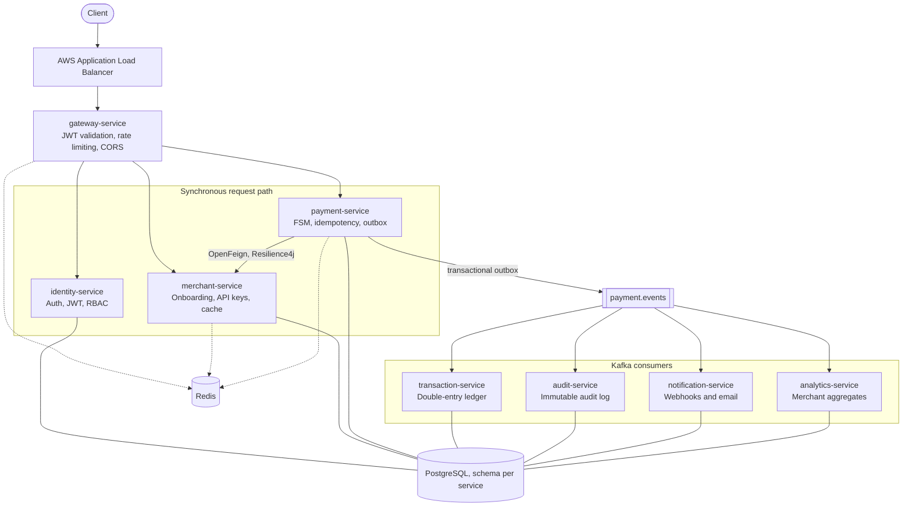
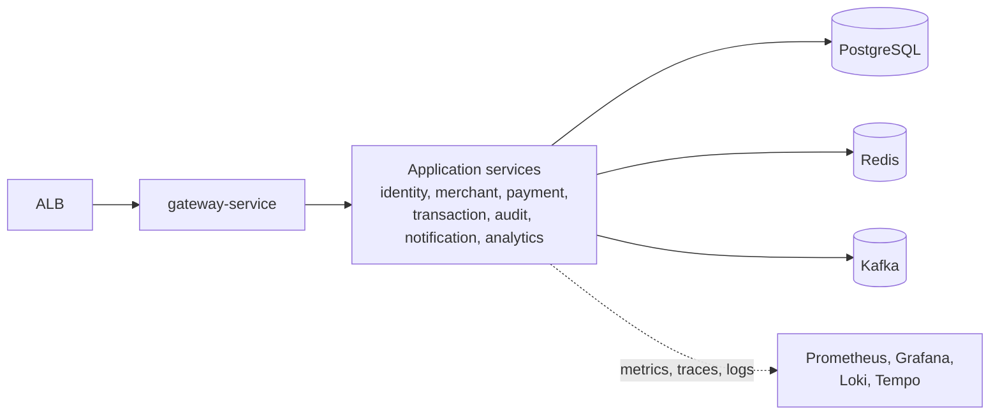
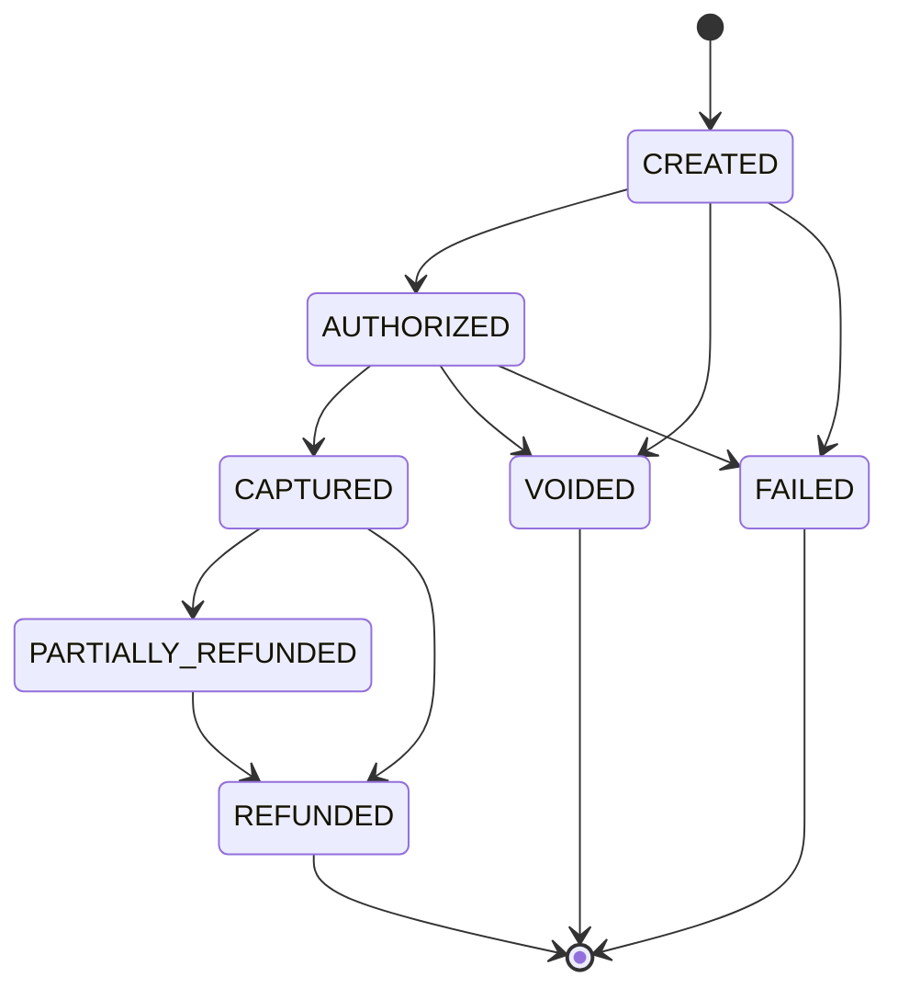
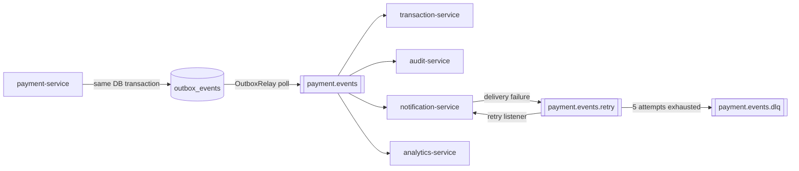
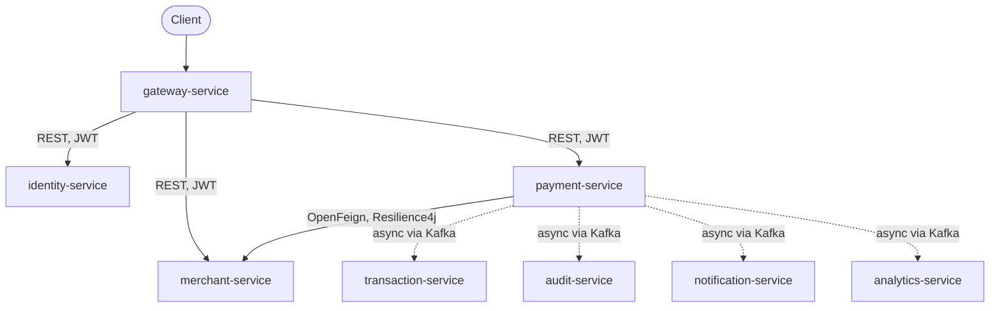
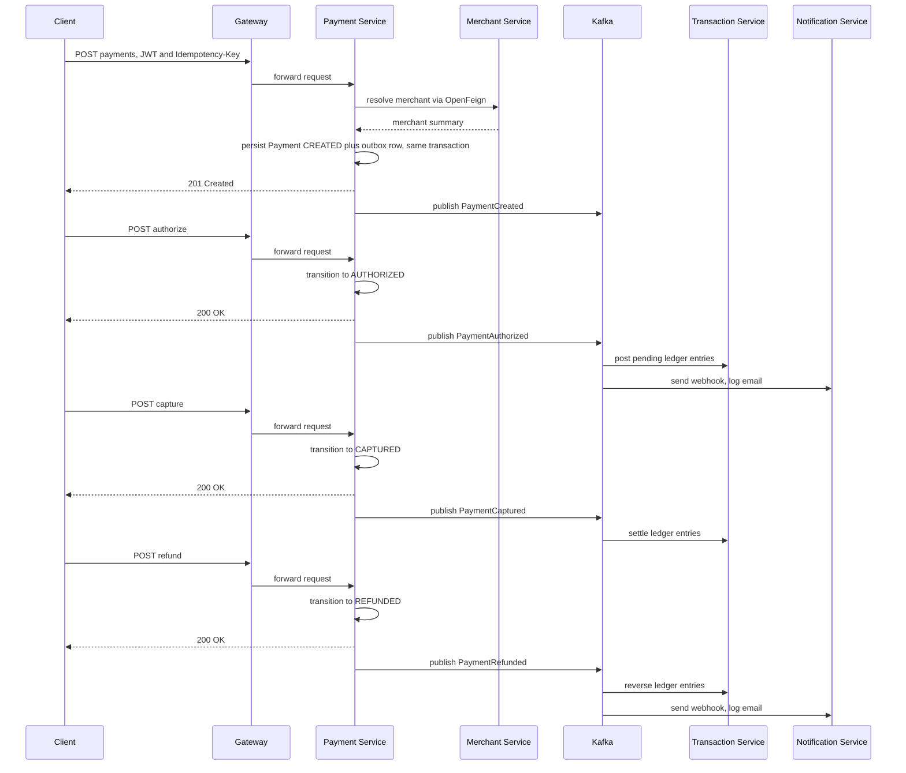

# PaymentFlow

**A distributed payment orchestration platform modeling how real-world processors handle the full payment lifecycle — across independently deployable microservices, not inside a monolith.**

[](https://github.com/IsaHaameem/cloud-native-payment-processing-platform/actions/workflows/ci.yml)


---

## Overview

PaymentFlow is a distributed payment orchestration platform that reproduces the core engineering problems a real payment processor has to solve: accepting a payment request, authorizing funds, capturing them, and issuing full or partial refunds — correctly, exactly once from the caller's point of view, and observably — across a set of independently deployable services rather than a single application. It implements the orchestration layer itself: the finite state machine governing a payment's lifecycle, the double-entry ledger that tracks where money actually sits, and the asynchronous propagation of that state to every service that needs to know about it.

The project was built as a final-year portfolio piece, deliberately scoped to hold up under backend and distributed-systems interview scrutiny rather than to be the fastest way to accept a payment. Every major design decision — at-least-once delivery instead of a mythical exactly-once guarantee, a transactional outbox instead of a dual write, schema-per-service instead of a shared database, integer minor units instead of floating-point currency — is deliberate and documented, reflecting trade-offs a production payment system genuinely has to make.

What separates it from a CRUD application is that the distributed-systems concerns are the point, not incidental plumbing. Idempotent mutation endpoints are backed by a Redis lock and a durable replay record. A polling transactional outbox guarantees a payment's database state and its outbound Kafka event never drift apart. A double-entry ledger uses optimistic-lock retry under real concurrent writes. A Resilience4j chain — retry, circuit breaker, timeout, bulkhead — wraps the platform's one synchronous cross-service call. The platform has been load-tested with Gatling under sustained, burst, and failure conditions, and deployed — not just designed — on real AWS infrastructure via Terraform, verified end-to-end with a full payment lifecycle executed over HTTP through a public Application Load Balancer.

The complete engineering log — every milestone, every trade-off considered and rejected, and the full test and verification record — is kept in [`PROJECT_CONTEXT.md`](PROJECT_CONTEXT.md).

### At a glance

- 8 independently deployable microservices behind a single reactive API gateway
- Event-driven core: transactional outbox, Kafka, idempotent consumers, a double-entry ledger
- Deployed and verified end-to-end on real AWS infrastructure (ECS Fargate, RDS, ElastiCache, a self-managed Kafka broker) provisioned entirely with Terraform
- Full observability stack: Prometheus, Grafana, Loki, Tempo, OpenTelemetry tracing
- Load-tested with Gatling under sustained, burst, and failure conditions — up to 107 rps mean throughput with a 69 ms p99 and zero platform-level bottlenecks found
- 230+ automated tests and 96 documented engineering trade-off decisions

---

## Table of Contents

- [Overview](#overview)
- [Architecture Overview](#architecture-overview)
- [Key Features](#key-features)
- [System Architecture](#system-architecture)
- [Technology Stack](#technology-stack)
- [Microservices](#microservices)
- [Project Structure](#project-structure)
- [Engineering Highlights](#engineering-highlights)
- [Security](#security)
- [Observability](#observability)
- [Infrastructure](#infrastructure)
- [Local Development](#local-development)
- [Environment Variables](#environment-variables)
- [API Overview](#api-overview)
- [Event-Driven Workflow](#event-driven-workflow)
- [Performance Characteristics](#performance-characteristics)
- [Testing](#testing)
- [Screenshots](#screenshots)
- [Future Enhancements](#future-enhancements)
- [Contributing](#contributing)
- [License](#license)
- [Acknowledgements](#acknowledgements)

---

## Architecture Overview

PaymentFlow follows a database-per-service microservices architecture behind a single reactive API gateway, with asynchronous propagation of payment state via Apache Kafka. A synchronous request touches at most one downstream service beyond the gateway; everything else that needs to know a payment happened — the ledger, the audit trail, notifications, and reporting — finds out asynchronously, through events, not through a chain of blocking calls.

Client traffic reaches the platform through an AWS Application Load Balancer and `gateway-service`, which validates JWTs against `identity-service`'s published JWKS, applies Redis-backed rate limiting, and routes to `identity-service`, `merchant-service`, or `payment-service`. `payment-service` is the only service that makes a synchronous call to another service (resolving the calling merchant via OpenFeign, wrapped in a full Resilience4j chain) and the only producer on the platform's main event topic. Every mutation to a payment is written to Postgres and to a transactional outbox row in the same database transaction; a polling relay then publishes that row to Kafka, where `transaction-service`, `audit-service`, `notification-service`, and `analytics-service` each consume it independently, idempotently, and at their own pace.

Each service owns its own PostgreSQL schema — there are no cross-service joins and no shared tables. Redis is used three ways: cache-aside for merchant profile reads, a distributed lock backing the idempotency guard on every mutating payment endpoint, and the token bucket behind the gateway's rate limiter. The entire stack is instrumented with Micrometer, scraped by Prometheus, visualized in Grafana, and traced end-to-end with OpenTelemetry into Grafana Tempo. It runs locally via Docker Compose and, in its cloud form, on AWS ECS Fargate provisioned entirely through Terraform.



---

## Key Features

**Authentication & Authorization**
- BCrypt password hashing and RS256-signed JWT access tokens, verified by every service against a shared JWKS endpoint — no shared secret across the fleet
- Opaque, SHA-256-hashed, rotating refresh tokens, revocable server-side (real logout, replay-detectable)
- Role-based access control enforced independently in every service (zero-trust; the gateway authenticates, it does not authorize)
- Merchant API keys: opaque, rotate-in-place, at most one active key per merchant enforced at the database level

**Payments**
- Explicit payment finite state machine (`CREATED → AUTHORIZED → CAPTURED → REFUNDED`, plus `FAILED`, `VOIDED`, `PARTIALLY_REFUNDED`) with illegal transitions structurally impossible, not just validated
- `Idempotency-Key` required on every mutating endpoint, backed by a Redis lock and a durable replay record
- Partial refunds that accumulate correctly to a full refund
- Money represented as integer minor units with an explicit currency code — never floating point

**Distributed Systems**
- Transactional outbox pattern — a payment's database state and its outbound Kafka event can never drift apart
- At-least-once event delivery with idempotent, durably-deduplicated consumers
- Saga-style orchestration centralized in `payment-service`
- Double-entry ledger (debit/credit-normal account types) with optimistic-lock retry under concurrent writes
- Correlation IDs propagated across every HTTP hop and Kafka message

**Caching**
- Redis cache-aside merchant profile reads with type-aware JSON serialization and cache-busting writes
- Redis distributed lock (`SETNX` + TTL) guarding idempotent mutations

**Messaging**
- Apache Kafka (KRaft mode) with explicit topic and consumer-group naming conventions
- Dedicated retry and dead-letter topics for webhook delivery, with jittered exponential backoff

**Observability**
- Micrometer metrics on every service, scraped by Prometheus
- Four Grafana dashboards covering platform health, business metrics, JVM internals, and infrastructure
- Distributed tracing via OpenTelemetry into Grafana Tempo, correlated with structured logs in Loki
- Seven Prometheus alert rules tied to real, emitted metrics

**Security**
- Redis-backed, per-identity token-bucket rate limiting at the gateway
- Structural IDOR prevention — merchant identity is always derived from the JWT, never accepted as a path or query parameter
- Cross-tenant resource access masked as 404, not 403
- All secrets (database credentials, Redis AUTH token, JWT signing keypair) generated and stored in AWS Secrets Manager, never committed or baked into images

**Infrastructure & Cloud**
- One shared, parameterized multi-stage Dockerfile building all 8 services identically, with non-root users and health checks
- A GitHub Actions CI pipeline that runs the full test suite and builds and verifies every Docker image on every push
- A complete AWS deployment — VPC, ALB, ECS Fargate, RDS, ElastiCache, a self-managed Kafka broker, Secrets Manager — provisioned entirely via Terraform and verified end-to-end over real HTTP
- OIDC-federated GitHub Actions deploy role — no long-lived AWS credentials stored anywhere

**Developer Experience**
- Gradle multi-module monorepo with a centralized version catalog and shared convention plugins
- A 7-simulation Gatling load-testing suite covering sustained, burst, contention, and failure scenarios
- Nearly 100 documented engineering decisions and trade-offs, with alternatives considered and rejected

---

## System Architecture

### High-Level Architecture



### Payment Flow



A payment may receive multiple partial refunds before reaching the terminal `REFUNDED` state. Every transition is guarded at the domain model itself — the `Payment` entity exposes no public status setter, so this diagram is the complete set of paths the system can take.

### Kafka Event Flow



### Service Communication



Only one synchronous cross-service call exists on the platform — `payment-service` resolving the calling merchant. Every other inter-service dependency is asynchronous, through Kafka.

### Payment Lifecycle Sequence



`audit-service` and `analytics-service` also consume every event asynchronously and are omitted here for readability.

---

## Technology Stack

| Technology | Purpose | Version |
|---|---|---|
| Java | Primary language | 25 (LTS) |
| Spring Boot | Application framework | 4.0.x |
| Spring Cloud Gateway | Reactive API gateway | 2025.1.0 |
| Spring Security | Authentication, method-level authorization, BCrypt hashing | — |
| Spring Data JPA | Persistence | — |
| PostgreSQL | Primary datastore, schema-per-service | 17 (RDS: 17.10) |
| Flyway | Schema migrations | — |
| Redis | Cache-aside, distributed locks, rate limiting | 8 (ElastiCache: OSS 7.1) |
| Apache Kafka | Event streaming, KRaft mode | 3.9 |
| OpenFeign | Synchronous inter-service HTTP client | — |
| Resilience4j | Circuit breaker, retry, timeout, bulkhead | — |
| Micrometer | Metrics facade | — |
| Prometheus | Metrics storage and alerting | — |
| Grafana | Dashboards | — |
| Loki | Log aggregation | — |
| Tempo | Distributed trace storage | — |
| OpenTelemetry | Tracing instrumentation and OTLP export | — |
| JUnit 5 / Mockito | Unit testing | — |
| Testcontainers | Integration testing against real dependencies | 2.x |
| Gatling | Load testing | 3.15.1.1 |
| Gradle (Kotlin DSL) | Build tool, multi-module monorepo, version catalog | 9.6.1 |
| Docker | Containerization, multi-stage builds | — |
| Docker Compose | Local orchestration | — |
| AWS ECS Fargate | Container orchestration (cloud) | — |
| AWS RDS / ElastiCache | Managed PostgreSQL / Redis (cloud) | — |
| AWS ALB | Load balancing | — |
| AWS Secrets Manager | Secret storage | — |
| Terraform | Infrastructure as code | — |
| GitHub Actions | CI/CD | — |

---

## Microservices

| Service | Responsibility | Database Schema | Events Published | Events Consumed |
|---|---|---|---|---|
| `gateway-service` | Edge routing, JWT validation, Redis rate limiting, CORS, correlation-ID injection | — | — | — |
| `identity-service` | User accounts, authentication, JWT issuance and refresh, RBAC, JWKS | `identity` | — | — |
| `merchant-service` | Merchant onboarding, API key issuance and rotation, cached profile reads, webhook URL config | `merchant` | — | — |
| `payment-service` | Payment FSM, idempotent mutations, Saga orchestration, transactional outbox | `payment` | `payment.events` (Created, Authorized, Captured, Refunded, PartiallyRefunded, Voided, Failed) | — |
| `transaction-service` | Double-entry ledger, idempotent event consumer, optimistic-lock retry | `transaction` | — | `payment.events` |
| `audit-service` | Immutable, schema-agnostic audit trail | `audit` | — | `payment.events` |
| `notification-service` | Simulated email log and webhook delivery with retry/DLQ | `notification` | `payment.events.retry`, `payment.events.dlq` | `payment.events`, `payment.events.retry` |
| `analytics-service` | Per-merchant reporting aggregates | `analytics` | — | `payment.events` |

Three additional shared modules — `platform-bom`, `common-dto`, and `common-lib` — are not deployable services; they carry dependency alignment, shared DTOs and the Kafka event envelope, and cross-cutting concerns (exceptions, correlation IDs, observability auto-configuration) consumed by all eight.

---

## Project Structure

```
.
├── build-logic/                  # Gradle convention plugins (shared build config)
├── platform-bom/                 # Dependency version alignment
├── common-dto/                   # Shared immutable DTOs + Kafka event envelope
├── common-lib/                   # Cross-cutting: exceptions, error envelope, correlation IDs, observability
├── gateway-service/
├── identity-service/
├── merchant-service/
├── payment-service/
├── transaction-service/
├── audit-service/
├── notification-service/
├── analytics-service/
├── load-tests/                   # Gatling load-testing suite (7 simulations)
├── observability/                # Prometheus, Grafana, Loki, Promtail, Tempo, Alertmanager config
├── terraform/
│   ├── bootstrap/                # Remote-state backend (S3 + DynamoDB lock table)
│   ├── environments/dev/         # Root module wiring every module together
│   └── modules/                  # networking, security-groups, ecr, iam, rds, elasticache,
│                                  # kafka-broker, alb, ecs-cluster, ecs-service, cloudwatch, secrets
├── docker/                       # PostgreSQL init scripts
├── .github/workflows/            # ci.yml, cd.yml
├── docker-compose.infra.yml      # Postgres, Redis, Kafka, Kafka-UI
├── docker-compose.yml            # 8 application services
├── docker-compose.observability.yml
├── Dockerfile                    # Shared, parameterized multi-stage build for all 8 services
├── gradle/libs.versions.toml
├── settings.gradle.kts
└── PROJECT_CONTEXT.md            # Full engineering log and milestone history
```

---

## Engineering Highlights

**Database-per-Service**
Each service owns an isolated PostgreSQL schema on a shared instance — schema-per-service rather than instance-per-service, chosen to get real data isolation without an eight-times cost multiplier. There are no cross-service joins anywhere in the platform, and every schema is version-controlled independently via its own Flyway migrations, with Hibernate set to `ddl-auto=validate` so the schema is always the source of truth.

**Transactional Outbox**
Dual-writing to a database and a message broker in two separate operations is a well-known source of inconsistency. Every state-changing payment mutation writes its Postgres row and an `outbox_events` row in the same database transaction. A separate scheduled relay polls for unpublished rows and publishes them to Kafka, marking them published only after a successful send — a row left unpublished after a crash is simply retried on the next tick, a deliberate at-least-once guarantee rather than a false promise of exactly-once.

**Idempotency**
Every mutating payment endpoint requires an `Idempotency-Key` header. A request first acquires a Redis `SETNX`-with-TTL lock for fast rejection of a concurrent duplicate, then checks a durable `idempotency_keys` table keyed per merchant against a fingerprint of the operation and body. A replayed request with a matching fingerprint returns the original stored response without reprocessing; the same key reused with a different body is rejected. The lock-then-commit-then-unlock sequence uses `TransactionTemplate` rather than declarative `@Transactional`, because the lock has to be held until the database commit actually lands, not just until the method returns.

**Double-Entry Ledger**
`transaction-service` posts every authorize, capture, and refund event as a balanced two-leg entry across three account types — a platform-wide clearing account and per-merchant pending and settled accounts — using pure, table-driven debit/credit-normal balance math. A fully-refunded payment lifecycle nets every account back to exactly zero, exercised as a direct correctness assertion in both the integration test suite and the load tests.

**Resilience: Retry, Circuit Breaker, Timeout, Bulkhead**
The platform's one synchronous cross-service call — `payment-service` resolving the calling merchant via Feign — is wrapped in a Resilience4j chain composed programmatically: retry with exponential backoff and jitter, a circuit breaker with slow-call detection, a time limiter, and a dedicated thread-pool bulkhead, so a hung `merchant-service` can only ever saturate its own small thread pool, never the application's main request-handling threads. Verified live by stopping `merchant-service` mid-session and observing the circuit open, fail fast, and recover automatically once the dependency came back.

**Rate Limiting**
The gateway applies a Redis-backed token-bucket limiter to every proxied route, keyed per authenticated user or per source IP for anonymous requests — including the brute-forceable auth endpoints, which have no JWT to key on yet.

**Caching**
Merchant profile reads use Spring's cache-aside annotations against Redis with a 10-minute TTL. The cache serializer embeds type metadata in the cached JSON so a cache hit reconstructs the concrete DTO rather than a raw map — a real bug caught only once a genuine cache-hit round trip was exercised under real cross-service traffic, since the original test suite's cache reads always happened to follow an eviction.

**Distributed Tracing & Correlation IDs**
Every request carries a correlation ID from the gateway through every downstream HTTP call and onto every Kafka message it produces. On top of that, OpenTelemetry generates and propagates a full trace across service boundaries, exported to Grafana Tempo — verified with a real trace whose ID appears in spans from two different services and in both services' own structured log lines for the same request.

**Metrics & Structured Logging**
Every service emits Micrometer metrics — HTTP, JVM, connection-pool, Kafka-client, cache, and Resilience4j meters automatically, plus hand-instrumented business counters recorded at the single choke-point method every relevant code path already funnels through, rather than scattered across call sites. Logs are structured JSON carrying correlation, request, trace, and span IDs, shipped to Loki and cross-linked with traces in Grafana.

---

## Security

**Authentication**
- Passwords hashed with BCrypt (strength 12)
- Access tokens are RS256-signed JWTs; every service validates signatures independently against `identity-service`'s published JWKS endpoint — no shared symmetric secret exists anywhere on the platform
- Refresh tokens are opaque, SHA-256-hashed before storage, rotated on every use, and revocable — a stolen refresh token cannot be used to mint new access tokens after logout

**Authorization**
- The gateway performs authentication only; role-based authorization is enforced independently in every downstream service, consistent with a zero-trust stance where no service implicitly trusts the edge
- Merchant identity for self-service endpoints is always derived from the JWT subject, never accepted as a path or query parameter — there is no merchant ID to guess
- Cross-tenant access to another merchant's payment is masked as `404`, not `403`, so it never confirms whether the resource exists

**API Keys**
- `merchant-service` issues opaque, SHA-256-hashed API keys that rotate in place; a partial unique database index guarantees at most one active key per merchant at the data layer, not just in application logic

**Gateway Security**
- CORS is restricted to a configured origin allow-list (currently `http://localhost:3000`, reserved for the planned merchant console)
- Standard security headers are applied at the edge: `X-Frame-Options`, `X-Content-Type-Options`, CSP, Permissions-Policy, Referrer-Policy, HSTS
- Redis-backed token-bucket rate limiting, scoped per authenticated identity or per source IP, applied to every route including the unauthenticated auth endpoints (20 requests/sec sustained, burst of 40, per identity)

**Secrets**
- Database credentials, the Redis AUTH token, and the JWT signing keypair are generated by Terraform and stored in AWS Secrets Manager; ECS resolves them natively at container start, so no secret is ever baked into an image, committed to the repository, or passed through application code as a manually-managed value

**Transport Security**
- Merchant webhook URLs must be HTTPS; a plain `http://` URL is rejected at the API layer
- The ALB currently terminates HTTP; an HTTPS listener is already wired in Terraform and activates as soon as an ACM certificate is supplied

---

## Observability

Every service is instrumented identically via a shared `ObservabilityAutoConfiguration` in `common-lib`, which tags every metric with the emitting service's name — the one label a single shared Prometheus instance scraping all 8 services needs.

- **Metrics** — Micrometer with `micrometer-registry-prometheus` on every service; `/actuator/prometheus` is scraped by a local Prometheus instance, with target health confirmed live for all 8 services.
- **Dashboards** — four auto-provisioned Grafana dashboards: Platform Overview (service health, request/error rates, latency percentiles, circuit-breaker state), Business Metrics (the full payment, ledger, webhook, audit, and auth funnel), JVM & Infrastructure (heap, GC, threads, connection pools, Kafka consumer lag), and an Infrastructure Deep-Dive (Redis, PostgreSQL, and Kafka broker-side metrics via dedicated exporters).
- **Alerting** — seven Prometheus alert rules (service down, elevated 5xx rate, an open circuit breaker, a failing outbox relay, an elevated webhook dead-letter rate, elevated ledger-posting retries, high JVM heap usage), evaluated by Alertmanager. No external paging channel is wired up — alerts are visible in-UI, the same honest stand-in the platform uses for its simulated email delivery.
- **Tracing** — distributed tracing via Spring Boot's official OpenTelemetry starter, 100% sampling, exported over OTLP to Grafana Tempo, cross-linked with logs and metrics in Grafana.
- **Logging** — structured JSON logs carrying correlation, request, trace, and span IDs, shipped to Loki via Promtail.
- **Health checks** — every service exposes `/actuator/health` plus liveness and readiness probes, used by each container's Docker `HEALTHCHECK` directive and by Compose's health-gated startup ordering.

The full observability stack (Prometheus, Grafana, Loki, Tempo, Alertmanager) currently runs locally via Docker Compose; it has not yet been deployed alongside the AWS environment, though every service ships the same instrumentation regardless of where it runs.

---

## Infrastructure

**Containerization** — a single, parameterized multi-stage Dockerfile builds all 8 services identically: a JDK-Alpine build stage runs the real Gradle wrapper against the monorepo and extracts the Spring Boot layered jar, and a JRE-Alpine runtime stage copies the layers in least-to-most-often-changing order behind a non-root user, with a `HEALTHCHECK` against `/actuator/health`.

**Local orchestration** — three composable Docker Compose files (infra, application services, observability), always run merged via multiple `-f` flags so health-gated startup ordering resolves correctly across all of them.

**CI** — `.github/workflows/ci.yml` runs the full Gradle test suite on every push and pull request, then builds and structurally verifies (non-root user, exposed port, a present health check) a Docker image for every service, capped at 4 concurrent builds. A failing test suite skips the Docker build stage entirely.

**CD** — `.github/workflows/cd.yml` (manual trigger) pushes every image to Amazon ECR and rolls each ECS service, authenticated through an OIDC-federated GitHub Actions role rather than long-lived AWS credentials.

**Cloud infrastructure** — provisioned entirely through Terraform (a dozen reusable modules plus one environment root) and applied to a real AWS account: a VPC across two availability zones with NAT, an internet-facing ALB fronting `gateway-service` only, an ECS Fargate cluster running all 8 application services plus a self-managed single-broker Kafka instance (KRaft mode, on Fargate with EFS-backed storage), RDS PostgreSQL, ElastiCache Redis, one ECR repository per service, and Secrets Manager. Internal service-to-service discovery uses ECS Service Connect against a private Cloud Map namespace, resolving each service by the same container DNS name the local Docker Compose network already uses. Remote Terraform state lives in S3 with DynamoDB locking.

**Verification** — this infrastructure has been applied for real, not just planned: all 9 ECS Fargate tasks (8 application services plus the Kafka broker) reached a healthy running state, RDS/Redis/Kafka connectivity was confirmed from each service's own logs, the ALB's target group reported the gateway healthy, and a complete register-login-onboard-create-authorize-capture-refund payment lifecycle was executed over real HTTP through the public ALB.

---

## Local Development

### Prerequisites
- JDK 25, or none at all — the build uses Gradle's Foojay toolchain auto-provisioning
- Docker and Docker Compose
- No local Gradle install needed; the wrapper is committed

### Clone

```bash
git clone https://github.com/IsaHaameem/cloud-native-payment-processing-platform.git
cd cloud-native-payment-processing-platform
```

### Configuration

```bash
cp .env.example .env
```

`.env` controls local infrastructure ports (Postgres, Redis, and Kafka default to a dedicated range so the stack coexists with other local projects) and observability ports and credentials. Defaults work out of the box; override only if something is already bound.

### Start the platform

```bash
# Infra + all 8 application services
docker compose -f docker-compose.infra.yml -f docker-compose.yml up -d

# Add the observability stack (Prometheus, Grafana, Loki, Tempo, Alertmanager)
docker compose -f docker-compose.infra.yml -f docker-compose.yml -f docker-compose.observability.yml up -d
```

Services come up in dependency order: infra healthy, then `identity-service`, then `merchant-service`/`payment-service` in parallel, then `gateway-service`, with the four Kafka-only consumers starting alongside `identity-service`.

### Default local ports

| Service | Port |
|---|---|
| gateway-service | 8080 |
| identity-service | 8081 |
| merchant-service | 8082 |
| payment-service | 8083 |
| transaction-service | 8084 |
| audit-service | 8091 |
| notification-service | 8092 |
| analytics-service | 8093 |
| PostgreSQL | 55432 |
| Redis | 56379 |
| Kafka | 59092 |
| Kafka-UI | 8085 |
| Prometheus | 9091 |
| Grafana | 3002 |

Additional observability ports are defined in `.env.example`.

### Run a single service outside Docker

```bash
SPRING_PROFILES_ACTIVE=local ./gradlew :identity-service:bootRun
```

### Build and test

```bash
./gradlew clean build
```

### Load tests

```bash
./gradlew :load-tests:gatlingRun
```

Simulations target `http://localhost:8080` by default and accept overrides such as `-DbaseUrl=`, `-DusersPerSec=`, and `-DdurationSeconds=`.

---

## Environment Variables

| Variable | Description | Required | Example |
|---|---|---|---|
| `SPRING_PROFILES_ACTIVE` | Activates the `local` profile (dev data seeding, local CORS defaults) | No | `local` |
| `SPRING_DATASOURCE_USERNAME` / `SPRING_DATASOURCE_PASSWORD` | PostgreSQL credentials for the service's own schema | Yes | — |
| `SPRING_DATA_REDIS_PASSWORD` | Redis AUTH password | Yes, where Redis is used | — |
| `SPRING_DATA_REDIS_SSL_ENABLED` | Enables TLS for Redis; required against AWS ElastiCache, unset locally | AWS only | `true` |
| `SPRING_KAFKA_BOOTSTRAP_SERVERS` | Kafka bootstrap servers | Yes, where Kafka is used | `kafka:19092` |
| `PAYMENTFLOW_SECURITY_JWT_PRIVATE_KEY` / `PAYMENTFLOW_SECURITY_JWT_PUBLIC_KEY` | RS256 signing keypair; `identity-service` only, ephemeral if unset in dev | No locally, yes in production | PEM-encoded key |
| `PAYMENTFLOW_SERVICES_IDENTITY_JWKS_URI` | JWKS endpoint every service validates JWTs against | Yes | `http://identity-service:8081/oauth2/jwks` |
| `PAYMENTFLOW_SERVICES_MERCHANT_BASE_URI` | Base URI `payment-service` uses to resolve merchants | Yes, `payment-service` | `http://merchant-service:8082` |
| `MANAGEMENT_OPENTELEMETRY_TRACING_EXPORT_OTLP_ENDPOINT` | OTLP endpoint traces are exported to | No, defaults to the local Tempo container | — |
| `COMPOSE_PARALLEL_LIMIT` | Caps concurrent Docker image builds to avoid exhausting local build-machine memory | No | `4` |
| `REDIS_EXPORTER_PORT` | Host port for the Redis Prometheus exporter | No | `9122` |

See `.env.example` for the complete list, including every infrastructure and observability port override.

---

## API Overview

All routes below are reached through `gateway-service`; only `/api/v1/auth/**` and `/oauth2/jwks` are unauthenticated. Every mutating payment endpoint additionally requires an `Idempotency-Key` header. Errors across every service render the same `ApiError` envelope — a stable machine-readable code, a correlation ID, and, for validation failures, field-level errors that never echo back the rejected value.

**Authentication & Users**

| Method | Path | Access |
|---|---|---|
| POST | `/api/v1/auth/register` | Public |
| POST | `/api/v1/auth/login` | Public |
| POST | `/api/v1/auth/refresh` | Public, valid refresh token |
| POST | `/api/v1/auth/logout` | Public, valid refresh token |
| GET | `/api/v1/users/me` | Authenticated |
| GET | `/api/v1/users` | ADMIN |
| GET | `/oauth2/jwks` | Public |

**Merchants**

| Method | Path | Access |
|---|---|---|
| POST | `/api/v1/merchants` | Authenticated, onboarding |
| GET | `/api/v1/merchants/me` | Authenticated, own profile, cached |
| PATCH | `/api/v1/merchants/me` | Authenticated, own profile |
| PATCH | `/api/v1/merchants/me/webhook` | Authenticated, own webhook URL, HTTPS-only |
| POST | `/api/v1/merchants/me/api-key/rotate` | Authenticated, own API key |
| GET | `/api/v1/merchants` | ADMIN, paginated |

**Payments**

| Method | Path | Access |
|---|---|---|
| POST | `/api/v1/payments` | Authenticated |
| POST | `/api/v1/payments/{id}/authorize` | Owning merchant |
| POST | `/api/v1/payments/{id}/capture` | Owning merchant |
| POST | `/api/v1/payments/{id}/refund` | Owning merchant |
| POST | `/api/v1/payments/{id}/void` | Owning merchant |
| GET | `/api/v1/payments/{id}` | Owning merchant |
| GET | `/api/v1/payments` | Owning merchant, paginated |

**Operational**

Every service also exposes `/actuator/health`, `/actuator/metrics`, and `/actuator/prometheus`.

---

## Event-Driven Workflow

Payment state changes propagate to the rest of the platform exclusively through Kafka — no consumer service ever calls `payment-service` synchronously.

**Topics**

| Topic | Partitions | Replication | Purpose |
|---|---|---|---|
| `payment.events` | 3 | 1 | Payment lifecycle domain events: Created, Authorized, Captured, Refunded, PartiallyRefunded, Voided, Failed |
| `payment.events.retry` | 3 | 1 | Webhook delivery retry queue, jittered exponential backoff, up to 5 attempts |
| `payment.events.dlq` | 3 | 1 | Dead-lettered webhook deliveries after retries are exhausted |

**Delivery guarantees**

- **At-least-once, not exactly-once.** The outbox relay and every consumer are built to tolerate redelivery rather than assume a message arrives exactly once.
- **Durable idempotent consumption.** Every consumer records a processed-event marker inside the same transaction as its own side effect, so a redelivered event is a genuine no-op rather than relying on Kafka offset tracking alone.
- **Optimistic-lock retry under contention.** Rows that every event for a given merchant or currency contends on — the ledger's shared clearing account, an analytics aggregate row — are protected with version-based optimistic locking and a jittered-backoff retry loop, verified under real concurrent load in both integration tests and the load-testing suite.
- **Schema-per-service applied to messaging too.** Most consumers define their own local copy of the event payload shape rather than sharing `payment-service`'s internal DTO. `audit-service` is a deliberate exception, storing each event as raw, schema-agnostic JSON, since its entire job is to record whatever came through unchanged.

---

## Performance Characteristics

All figures below are real Gatling output from the load-testing milestone, run against the full local Docker Compose stack — never against the AWS deployment, which runs one unscaled task per service with no autoscaling and would not produce a representative result. A full payment lifecycle means the 7-call sequence: register, login, onboard merchant, create, authorize, capture, refund. Steady-state simulations reuse a pre-seeded merchant pool rather than registering per iteration, so these numbers measure the payment hot path itself, not registration overhead.

| Simulation | Load Profile | Requests | Success | Mean | p50 | p95 | p99 | Max | Throughput |
|---|---|---|---|---|---|---|---|---|---|
| Smoke | 1 user, full lifecycle | 7 | 100% | — | — | — | — | — | — |
| Sustained | 5 users/sec constant x 120s | 2,400 | 100% | 28 ms | 20 ms | 75 ms | 119 ms | 373 ms | 20 rps |
| Burst | 2 to 60 to 2 users/sec over ~70s | 7,520 | 100% | 17 ms | 14 ms | 38 ms | 69 ms | 399 ms | 107.4 rps mean |
| Concurrent Contention | 80 users onto 3 merchants in 5s | 320 | 100% | 25 ms | 12 ms | 68 ms | 393 ms | 512 ms | 64 rps |
| Failure Scenarios | mixed, see below | 370 | 100%* | — | — | — | — | — | — |

\* Failure Scenarios intentionally exercises non-2xx paths (401, 409, 429); "100%" means every request received the expected status code, not that every request returned 2xx.

**Resource utilization under peak load** (Burst simulation, 60 users/sec)
- Peak JVM heap stayed well inside default container memory across every service — `payment-service`, the busiest, peaked at 142 MB.
- Peak HikariCP active connections never exceeded 3 out of a pool of 10, on any service.
- `payment-service` briefly touched 100% of its allotted CPU share during the burst hold, as expected since it sits on the critical path for every request; every other service stayed under 30%.

**Correctness under concurrency** (Concurrent Contention simulation)
- 575 optimistic-lock retries fired on the shared ledger clearing account under real contention.
- Zero failed requests — the retry loop absorbed all contention as designed.
- The 3 hot-pool merchants' ledger accounts netted to exactly zero after full refund, verified directly against Postgres.

**Rate limiting under load** (Failure Scenarios simulation)
- A single session firing 100 unpaced requests tripped 132 real `429` responses from the gateway's Redis-backed limiter.
- The Burst simulation's 60 users/sec spike produced zero `429`s — that load was spread across 100 distinct pooled merchant identities, none of which individually exceeded its per-identity budget, confirming the limiter is scoped per-identity rather than a blunt global throttle.

**Capacity estimate**
Based on the Burst run's 107 rps mean throughput with a 69 ms p99 and no resource-exhaustion signal from any service, sustained throughput in the 100 to 150 rps range for the full payment hot path appears safely achievable with p99 latency under 100 ms. This is not a production capacity number — it reflects one unscaled container per service on shared developer-machine hardware. No genuine platform-level bottleneck was found at any load level tested; horizontal scaling behind the existing ALB target group is the expected next lever if real traffic approached these numbers.

---

## Testing

**Unit testing** — JUnit 5 and Mockito cover business logic in isolation: the payment finite state machine (every legal transition and a wide sample of illegal ones), idempotency fingerprinting and lock handling, ledger debit/credit math for both account polarities, and the Resilience4j decorator chain built against real Resilience4j registries with only the Feign client mocked.

**Integration testing** — Testcontainers spins up real PostgreSQL, Redis, and Kafka for every service's integration suite; no mocked infrastructure. Several tests are deliberately adversarial: a genuine two-thread race on the same idempotency key that asserts exactly one payment results regardless of which side wins, a 10-thread concurrent-posting test against one shared ledger account, and message-redelivery and malformed-message handling for every Kafka consumer.

**Resilience testing** — beyond automated tests, the Resilience4j chain was verified against a real running platform: `merchant-service` was stopped mid-session, and `payment-service` was observed retrying, then failing fast once the circuit opened, then recovering automatically back to closed once the dependency returned, with elapsed-time logging confirming each phase.

**Load testing** — a 7-simulation Gatling suite (see Performance Characteristics) exercises sustained load, burst traffic, deliberately manufactured contention, and mixed failure paths against the full local stack.

**End-to-end verification** — every milestone's changelog records a real, manually-driven end-to-end pass through the running system, not just green tests, including a full payment lifecycle confirmed over real HTTP through the public AWS ALB, with every downstream consumer's effect independently verified against Postgres.

**Scale** — as of the containerization milestone the monorepo carried 230+ automated tests across all modules, with further coverage added alongside the metrics and tracing instrumentation that followed.

---

## Screenshots

Screenshots are not yet included in this repository. Suggested locations once captured:

```
docs/images/grafana-platform-overview.png     — Platform Overview dashboard
docs/images/grafana-business-metrics.png      — Business Metrics dashboard
docs/images/tempo-trace-view.png              — A distributed trace spanning two services
docs/images/kafka-ui-topics.png               — payment.events topic in Kafka-UI
docs/images/gatling-report.png                — A Gatling HTML load-test report
```

---

## Future Enhancements

**Planned**
- A Next.js merchant console (TypeScript, Tailwind CSS) for self-service dashboards
- Expanded OpenAPI/Swagger documentation
- Additional architecture diagrams and interview-preparation notes

**Longer-term**
- gRPC for internal synchronous calls
- API versioning
- Blue/green deployments on ECS
- A dedicated OpenTelemetry Collector

**Known limitations**
- No merchant-API-key-based authentication path exists for payment creation yet — only JWT-via-gateway is supported, deferred until a real server-to-server caller needs it.
- Ledger, audit, and analytics data have no query API yet; verifying that data currently requires a direct database query.
- Webhook deliveries are not yet cryptographically signed — no HMAC scheme.
- The notification service's email channel is a simulated, durably-logged send; no real SMTP/SES provider is wired up.
- The observability stack runs locally only and has not yet been deployed alongside the AWS environment.
- The CD pipeline is implemented but has not yet been exercised with live repository secrets — images have so far been pushed to ECR by hand.

---

## Contributing

This project is currently maintained as a solo portfolio project, but issues and pull requests are welcome.

1. Fork the repository and create a feature branch off `main`.
2. Follow the existing conventions — schema-per-service, immutable DTOs, constructor injection, and no cross-service compile-time coupling on event payload shapes.
3. Add or update tests for any behavioral change; integration tests should exercise real dependencies via Testcontainers wherever practical.
4. Run `./gradlew clean build` locally and confirm it passes before opening a pull request.
5. Open a pull request describing the change and the reasoning behind it — `PROJECT_CONTEXT.md` is a good reference for the level of detail that's useful.

---

## License

This project is licensed under the MIT License. See [`LICENSE`](LICENSE) for details.

---

## Acknowledgements

PaymentFlow's design is informed by publicly documented patterns from real payment processors, particularly Stripe and Razorpay, and by widely used distributed-systems patterns — transactional outbox, saga orchestration, idempotent consumers — rather than any single reference implementation. Built with Spring Boot, Apache Kafka, Redis, PostgreSQL, and the broader open-source ecosystem those projects depend on.
